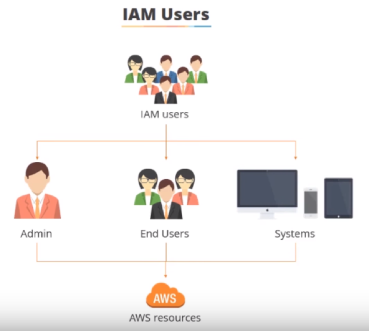
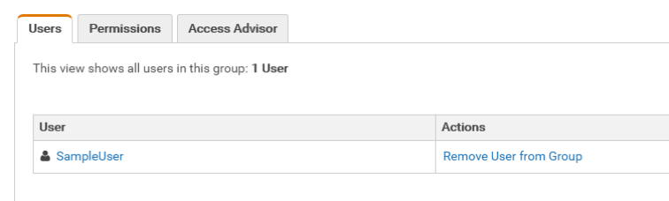
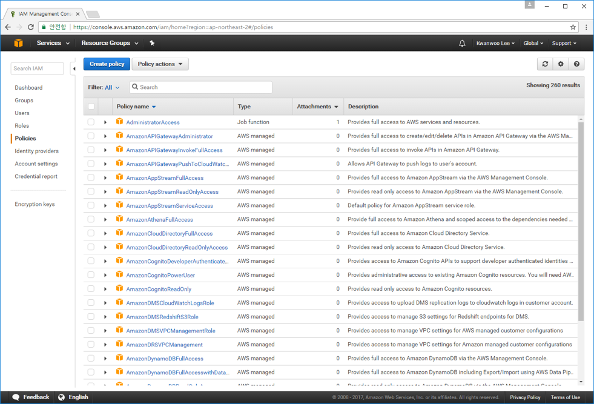

<style>
div.polaroid {
  	width: 400px;
  	box-shadow: 0 10px 30px 0 rgba(0, 0, 0, 0.2), 0 16px 30px 0 rgba(0, 0, 0, 0.19);
  	text-align: center;
	margin-bottom: 0.5cm;
}
</style>

# Amazon IAM
- [Amazon IAM 소개](#1)
- [자격증명](#2)
- [액세스 관리](#3)
- [Amazon IAM 실습](#exercise)

---
<a name="1"> </a>
## 1. Amazon IAM 소개

<iframe width="560" height="315" src="https://www.youtube.com/embed/Ul6FW4UANGc" frameborder="0" allow="autoplay; encrypted-media" allowfullscreen></iframe>

https://youtu.be/Ul6FW4UANGc

### 1.1 AWS Identity and Access Management(IAM) 이란?
- AWS Identity and Access Management(IAM)는 Amazon Web Services(AWS) 고객사가 AWS에서 사용자와 이에 부여된 권한을 관리할 수 있게 해주는 웹 서비스입니다

- 이 서비스는 클라우드에서 Amazon EC2, Amazon SimpleDB 및 AWS Management Console과 같은 AWS 제품을 사용하는 여러 사용자 또는 시스템이 있는 조직을 위해 개발되었습니다. 

- IAM을 통해 사용자, 액세스 키와 같은 보안 자격 증명, 사용자가 어떤 AWS 리소스에 액세스할 수 있는지 제어하는 권한을 한 곳에서 관리할 수 있습니다.

### 1.2 IAM 기능
- AWS 계정에 대한 공유 액세스
	- 암호나 액세스 키를 공유하지 않고도 AWS 계정의 리소스를 관리하고 사용할 수 있는 권한을 다른 사람에게 부여할 수 있습니다.
- 세분화된 권한
	- 리소스에 따라 여러 사람에게 다양한 권한을 부여할 수 있습니다.
	- 예, 사용자 A에게는 EC2, S3에 대한 전체 권한을, 사용자 B에게는 S3 버킷에 대한 읽기 전용 권한 부여
- Amazon EC2에서 실행되는 애플리케이션을 위한 보안 AWS 리소스 액세스
	- 애플리케이션이 다른 AWS 리소스 (예, S3 버킷 및 DynamoDB 테이블)에 액세스할 수 있는 권한을 제공할 수 있습니다. 
- 멀티 팩터 인증 (MFA)
	 - 보안 강화를 위해 계정과 개별 사용자에게 2팩터 인증을 추가할 수 있습니다. MFA를 사용할 경우 계정 소유자나 사용자가 계정 작업을 위해 암호나 액세스 키뿐 아니라 특별히 구성된 디바이스의 코드도 제공해야 합니다.

- 자격 증명 연동
	- 기업 네트워크나 인터넷 자격 증명 공급자와 같은 다른 곳에 이미 암호가 있는 사용자에게 AWS 계정에 대한 임시 액세스 권한을 부여할 수 있습니다.

### 1.3 IAM 작동 방식 이해
- IAM은 계정에 대한 인증 및 권한 부여를 제어하는 데 필요한 인프라를 제공합니다. IAM 인프라에는 다음 요소가 포함되어 있습니다
	- [Principal](#pricipal)
	- [요청](#request)
	- [인증](#auth)
	- [승인](#approval)
	- [Actions](#action)
	- [리소스](#resource)

	
	
<a name="pricipal"> </a>
#### Principal
- **보안 주체 (Pricipal)**란 AWS 리소스에 대한 작업을 수행할 수 있는 개체
	- 사용자
	- 역할
	- 애플리케이션

<a name="request"> </a>
#### 요청
- **보안 주체**가 AWS에 전송하는 요청은 다음 정보를 포함
	- 보안 주체가 수행할 **작업(또는 동작)**
	- 작업이 수행되는 **리소스**
	- 요청이 이루어지는 환경을 비롯한 **보안 주체 정보**

<a name="auth"> </a>
#### 인증
- 보안 주체는 AWS에 요청을 전송하기 위해 인증을 받아야 합니다
- 인증 방식
	- 콘솔에서 인증하려면 사용자 이름 및 암호로 로그인
	- API 또는 CLI에서 인증하려면 액세스 키 및 보안 키를 제공

<a name="approval"> </a>
#### 승인
- IAM은 요청 컨텍스트의 값을 사용하여 일치하는 정책을 확인하고, 요청을 허용할지 거부할지 여부를 결정
	- 정책은 JSON 문서로 IAM에 저장되고, 보안주체 및 리소스에 허용될 혹은 거부될 권한을 명시한다.
	- IAM은 요청 컨텍스트와 일치하는 각 정책을 확인합니다.
	- 단일 정책에 거부된 작업이 포함된 경우 IAM은 전체 요청을 거부하고 평가를 중지합니다.
		 -  IAM은 일치하는 정책이 요청의 모든 부분을 허용하는 경우에만 요청에 권한을 부여 함
		 
<a name="acation"> </a>
#### Actions
- 작업은 서비스로 정의되며 리소스 보기, 생성, 편집 및 삭제와 같이 리소스에 대해 수행할 수 있는 사항

<a name="resource"> </a>
#### 리소스
- 리소스는 서비스 내에 존재하는 개체입니다. 
	- 예를 들어 Amazon EC2 인스턴스, IAM 사용자 및 Amazon S3 버킷이 있습니다 

<a name="2"> </a>
## 2. 자격 증명 (사용자, 그룹, 역할)
### 2.1 개요
- **루트 계정 자격 증명**
	- 계정을 생성할 때 입력한 이메일 주소와 암호 조합
	- AWS 계정의 모든 리소스에 완전히 무제한으로 액세스
	- 루트 계정 자격 증명을 타인과 공유하지 않는 것이 좋음
	- 루트 계정에 부여된 권한을 제한할 수는 없음
- **AWS IAM 자격 증명**
	- **IAM 사용자**
		- 별개의 계정이 아니라 해당 계정 내의 사용자
		- 고유의 AWS Management Console 액세스 암호를 가질 수 있음
		- IAM 사용자가 실제 사람일 필요는 없음 (애플리케이션일 수 있음)
	
	
	
- 기존 자격 증명을 AWS에 연동
	- 사용자를 인증할 방법이 있는 경우(예: 회사 네트워크에 로그인), 해당 사용자 자격 증명을 AWS에 연동

	

### 2.2 IAM 사용자
- IAM 사용자는 AWS에서 생성하는 엔터티로서 AWS와 상호 작용하기 위해 그 엔터티를 사용하는 사람 또는 서비스를 대표합니다. 
	- IAM 사용자가 실제 사람을 나타낼 필요는 없습니다. 
	- 자격 증명이 있어야 AWS로 요청을 보낼 수 있는 애플리케이션을 나타내기 위해 IAM 사용자를 만들 수 있습니다

	

#### 2.2.1 보안 자격 증명 (Security Credential)
- IAM 사용자는 다양한 자격 증명 유형을 이용하여 AWS에 액세스
	- 콘솔 암호
		- 사용자가 입력해 AWS Management Console과 같은 상호 작용 세션으로 로그인할 수 있는 암호.
			- AWS 루트  계정과 암호
			- IAM 사용자 계정과 암호

	- 액세스 키
		- 액세스 키는 액세스 키 ID와 보안 액세스 키를 조합한 형식
		- 한 사용자에게 한 번에 두 개를 지정할 수 있습니다. 이 액세스 키들은 프로그램 코드나 명령 프롬프트에서 API를 사용할 때 AWS에 대한 프로그래밍 방식 호출에 쓸 수 있습니다.

	- 멀티 팩터 인증 (Multi-Factor Authentification) 
		- 하드웨어 디바이스에서 또는 스마트폰/태블릿의 애플리케이션을 통해 생성되거나 AWS에서 SMS 호환 모바일 디바이스로 전송한 임시 숫자 코드를 통해 사용자 자격증명의 보안을 강화

#### 2.2.2 IAM 사용자 생성 [실습]

AWS Management Console에서 한 명 이상의 IAM 사용자를 생성하려면

1. https://console.aws.amazon.com/iam/ 에서 IAM 콘솔에 로그인합니다.
2. 탐색 창에서 [**Users**]와 [**Add user**]를 차례로 선택합니다.
3. 신규 사용자의 사용자 이름을 입력합니다. 
	- *Administrator* 입력
	-  이것은 AWS에 로그인할 때 사용하는 이름입니다. 하나 이상의 사용자를 동시에 추가하려면, 추가하는 각 사용자에 대해 Add another user를 선택한 후 사용자 이름을 입력합니다. 한 번에 최대 10명까지 사용자를 추가할 수 있습니다.
	
4. 이 사용자 세트에게 부여할 액세스 권한의 유형을 선택합니다.
	- [**Programmatic access**] 와 [**AWS Management Console access**] 선택
		- [**Autogenerated password**] 선택
		- [**Require password reset**] 선택
5. [**Next: Permissions**]를 선택합니다.
6. Set permissions 페이지에서 이 신규 사용자 세트에 권한을 할당하는 방식을 지정합니다. 
	- **Attach existing policies to user directly**** 을 선택
7. 정책 목록에서 [**AdministratorAccess**] 옆의 확인란을 선택합니다. 
8. [**Next: Review**]를 선택하여 이 시점까지 한 선택을 모두 확인합니다. 계속 진행할 준비가 되었으면 [**Create user**]를 선택합니다.
9. 사용자의 액세스 키(액세스 키 ID와 보안 액세스 키)를 보려면, 보고 싶은 각 암호와 보안 액세스 키 옆에 있는 **Show**를 선택합니다. 액세스 키를 저장하려면 Download.csv를 선택한 후 안전한 위치에 파일을 저장합니다.
	- **중요**
		- **보안 액세스 키는 이 때만 확인 및 다운로드가 가능**하기 때문에 사용자에게 AWS API를 사용하도록 하려면 이 정보를 제공해야 합니다. 사용자의 새 액세스 키 ID와 보안 액세스 키를 안전한 장소에 보관하십시오. **이 단계가 지난 후에는 보안 키에 다시 액세스할 수 없습니다.**
10. 각 사용자에게 해당 자격 증명을 제공합니다. 최종 페이지에서 각 사용자 옆에 있는 **Send email**을 선택합니다. 로컬 메일 클라이언트는 사용자 지정을 거쳐 발송할 수 있는 초안 형태로 열립니다. 이메일 템플릿에는 각 사용자에 대한 세부 정보가 다음과 같이 포함되어 있습니다.
	- 사용자 이름
	- 계정 로그인 웹 페이지의 URL.
	
		```
		https://AWS-account-ID or alias.signin.aws.amazon.com/console
		```
		
#### 2.2.3 IAM 사용자가 AWS에 로그인하는 방법
- IAM 사용자로 AWS Management 콘솔에 로그인하려면 사용자 이름과 암호 이외에 계정 ID 또는 계정 별칭을 제공해야 합니다.
	- AWS 관리 콘솔에서 IAM 사용자를 만든 경우에 이메일로 전송된 **로그인 페이지 URL**에 계정 ID 또는 계정 별칭이 포함됨

		```
		https://My_AWS_Account_ID.signin.aws.amazon.com/console/
		```
		- 사용자 이름과 암호는 IAM 사용자 생성 시에 저장한 정보 이용함
	- 다음의 일반 로그인 엔드포인트에서 로그인하고 계정 ID 또는 계정 별칭을 직접 입력하고 로그인할 수도 있습니다.
	
		```
		https://console.aws.amazon.com/
		```
- AWS 로그인 페이지는 IAM 사용자 이름 및 계정 정보를 기억하기 위해 브라우저 쿠키를 사용함.


#### 2.2.4 멀티 팩터 인증 [실습]
MFA는 사용자가 AWS 웹 사이트 또는 서비스에 액세스할 때 승인된 인증 디바이스 또는 SMS 문자 메시지의 고유 인증 코드를 입력하라고 요청함으로써 보안을 더욱 강화

1. https://console.aws.amazon.com/iam/ 에서 IAM 콘솔에 로그인합니다.
2. 탐색 창에서 [**Users**]를 선택합니다.
3. [**User Name**] 목록에서 원하는 MFA 사용자 이름을 선택합니다.
4. [**Security credentials**] 탭을 선택한 다음, [**Assigned MFA device**] 옆의 편집 아이콘을 선택합니다.
5. [**Manage MFA Device**] 마법사에서 [**A virtual MFA device**]와 [**Next Ste**p]을 차례대로 선택합니다.
6. 가상 MFA 애플리케이션(Google Authentification)을 엽니다. 
	- 앱 목록은 https://aws.amazon.com/ko/iam/details/mfa/#Virtual_MFA_Applications 을 참조
7. 새로운 계정( + )을 생성하고, 앱을 사용하여 QR코드를 스캔합니다.
8. [**Manage MFA Device**] 마법사의 [**Authentication Code 1**] 상자에 현재 가상 MFA 디바이스에 표시된 일회용 암호를 입력합니다. 디바이스가 새로운 일회용 암호를 생성할 때까지 최대 30초 기다립니다. 그런 다음 두 번째 일회용 암호를 [**Authentication Code 2**] 상자에 입력합니다. [**Active Virtual MFA**]를 선택합니다.


### 2.3 IAM 그룹
- IAM 그룹은 IAM 사용자들의 집합입니다.
- 그룹을 활용하면 다수의 사용자들에 대한 권한을 지정함으로써 해당 사용자들에 대한 권한을 더 쉽게 관리할 수 있습니다.
- 다음은 그룹이 갖는 몇 가지 중요한 특징
	- 한 그룹에 여러 사용자가 포함될 수 있으며 한 사용자가 다중 그룹에 속할 수 있습니다.
	- 그룹은 중첩될 수 없습니다. 즉, 그룹은 사용자만 포함할 수 있으며 다른 그룹은 포함할 수 없습니다.
	- AWS 계정의 모든 사용자를 자동으로 포함하는 기본 그룹은 없습니다. 이러한 그룹이 필요한 경우 하나 만들어 새로운 사용자를 각각 해당 그룹에 할당해야 합니다.
	- 보유할 수 있는 그룹의 수와 사용자가 속할 수 있는 그룹의 수에는 제한이 있습니다. 자세한 내용은 [IAM 주체 및 객체에 대한 제한 사항 단원](https://docs.aws.amazon.com/ko_kr/IAM/latest/UserGuide/reference_iam-limits.html)을 참조하십시오.

#### 2.3.1 IAM 그룹 생성 [실습]
IAM 그룹을 만들어 정책을 연결하려면(AWS Management Console)

1. https://console.aws.amazon.com/iam/ 에서 IAM 콘솔에 로그인합니다.
2. 탐색 창에서 [**Groups**]를 클릭한 다음 [**Create New Group**]을 클릭합니다.
3. [**Group Name**] 상자에 그룹 이름을 입력한 다음 [**Next Step**]을 클릭합니다.
	- *SampleReadGroup* 입력
4. 정책 목록에서 그룹 멤버 전체에 적용하고자 하는 정책 이름마다 확인란을 선택합니다. 
	- [**Filter**] 상자에 *S3* 입력 후, *SampleS3ReadOnlyAccess* 정책 선택
	- 그런 다음 [**Next Step**]을 클릭합니다.
5. [**Create Group**]을 클릭합니다.

#### 2.3.2 IAM 사용자 생성 및 IAM 그룹에 사용자 추가 [실습]
1. 탐색 창에서 [**Users**]와 [**Add user**]를 차례로 선택합니다.
2. 신규 사용자의 사용자 이름을 입력합니다.
	- *SampleUser* 입력
3. 이 사용자 세트에게 부여할 액세스 권한의 유형을 선택합니다.
	- [**AWS Management Console access**] 선택
		- [**Autogenerated password**] 선택
		- [**Require password reset**] 선택
4. [**Next: Permissions**]를 선택합니다.
5. [**Next: Review**], [**Create user**], [**Close**] 차례로 선택
6. 탐색 창에서 [**Groups**]를 클릭한 다음 그룹 이름을 선택합니다. 
7. [**Users**] 탭을 선택한 후 [**Add Users to Group**]를 선택합니다. 추가하려는 사용자를 선택한 후 [**Add Users**]를 선택합니다.

	

<a name="3"> </a>	
## 3 액세스 관리
- AWS IAM의 액세스 관리를 통해 계정에서 사용자 또는 다른 개체에게 허용된 권한을 정의할 수 있습니다. 
	
### 3.1 정책 
- 사용자, 그룹, 역할 또는 리소스에 할당될 권한을 명시적으로 나열한 문서

- 정책의 구성요소
	- **작업**: 허용할 작업
	- **리소스**: 해당 작업을 허용할 리소스
	- **결과**: *허용* 혹은 *거부*
- JavaScription Object Notation(JSON) 형식

	```
	{ 
	    "Version": "2012-10-17", 
	    "Statement": { 
		"Effect": "Allow", 
		"Action": "s3:ListBucket", 
		"Resource": "arn:aws:s3:::example_bucket" 
	    } 
	}
	```
	- us-east-2 리전 내 123456789012 계정의 Books 테이블에서 모든 Amazon DynamoDB 작업(dynamodb:*)을 수행할 수 있는 권한을 부여하는 정책
	
#### 3.1.1 IAM 사용자 및 정책
- 기본적으로 IAM 사용자는 계정에 전혀 액세스할 수 없습니다. 
	- 사용자에게 연결된 정책인 자격 증명 기반 정책을 생성하여 사용자에게 권한을 부여합니다.
	- 명시적으로 허용되지 않은 작업 또는 리소스는 기본적으로 모두 거부됩니다.
		- 예를 들어 위 정책이 사용자에게 연결된 유일한 정책이라면 이 사용자는 Books 테이블에서만 DynamoDB 작업을 수행할 수 있습니다. 다른 모든 테이블에 대한 작업은 금지됩니다. 마찬가지로 사용자는 Amazon EC2, Amazon S3 또는 다른 모든 AWS 서비스에서 어떤 작업도 수행할 수 없습니다.  

#### 3.1.2 미리 정의된 AWS 정책
- AWS는 AWS 리소스에 세분화된 접근 권한을 정의한 다양한 정책을 사전에 정하고 있습니다.

	

### 3.2 IAM 정책 생성 [실습]
- 목표
	- Amazon S3 버킷에 읽기 전용 접근을 허용하는 정책을 생성합니다.

1. https://console.aws.amazon.com/iam/ 에서 IAM 콘솔에 로그인합니다.
2. 왼쪽의 탐색 열에서 [**Policies**]를 선택합니다.
	- [**Policies**]를 처음으로 선택하는 경우 Welcome to Managed Policies 페이지가 나타납니다. [**Get Started**]를 선택합니다.
4. 페이지 위쪽에서 [**Create Policy**]를 선택합니다.
5. [**Create Policy**] 페이지에서 다음 옵션 중 하나에 대해 [**Select**]를 선택합니다. 그런 다음 선택한 절차에서 해당 단계를 따릅니다.
	- [기존 관리형 정책 가져오기](#1) — 기존의 관리형 정책을 복사하고 새로운 목적으로 복사를 사용자 지정할 수 있습니다.
	- [시각적 편집기를 사용하여 정책 생성] — 목록에서 항목을 선택할 수 있도록 함으로써 정책을 생성합니다.
	- [JSON 탭에서 정책생성] — 빈 정책이 있는 정책 편집기가 열리고 이 편집기에서 정책을 입력하거나 복사하고 붙여 넣을 수 있습니다.

<a name="#1"></a>
#### 3.2.1 기존 관리형 정책 가져오기
새 정책을 생성하는 쉬운 방법은 최소한으로 필요한 권한 중 일부가 이미 존재하는 계정으로 기존 관리형 정책을 가져오는 것입니다. 그런 다음, 새로운 요구 사항에 일치하도록 정책을 사용자 지정할 수 있습니다.

1. IAM 정책 생성(콘솔)의 단계를 따라 [**Create policy**] 마법사를 시작합니다. [**Visual editor**] 탭을 선택한 다음 페이지 오른쪽에서 [**Import managed policy**]를 선택합니다.

2. [**Import managed policies**] 창에서 새 정책에 포함할 정책과 가장 근접한 관리형 정책을 선택합니다. [**Filter**] 메뉴를 사용하거나 상단의 검색 상자에 입력하여 정책 목록의 결과를 제한할 수 있습니다.
	- 검색창에 *S3* 입력 후에, *AmazonS3ReadOnlyAccess* 선택
	
3. [**Import**]를 선택합니다.

	- 가져온 정책은 정책 하단의 새 권한 블록에 추가됩니다.

4. [**Visual editor**]를 사용하거나 [**JSON**]을 선택하여 정책을 수정 합니다. 그런 다음 [**Review policy**]를 선택합니다.
5. [**Review**] 페이지에서 생성하는 정책에 대한 이름과 설명(선택 사항)을 입력합니다. 이러한 필드는 나중에 편집할 수 없습니다. 정책 요약을 검토한 다음 [**Create policy**]를 선택하여 작업을 저장합니다.


<a name="exercise"> </a>	
## 4. Amazon IAM 실습	
1. 다음과 같은 세 개의 그룹과 네 명의 사용자를 생성하고, 그룹별 Permssion 설정
	- GroupA : Amazon EC2로의 FullAccess를 허용(AmazonEC2FullAccess)
		- UserA 
		- UserB
	- GroupB : AWS 모든 리소스로의 Access를 허용 (AministratorAccess)
		- UserC
	- GroupC : Amazon S3로의 ReadOnlyAccess를 허용 (AmazonS3ReadOnlyAccess)
		- UserD

2. UserA, UserB, UserC, UserD로 접속하여 다음을 체크
	- UserA, UserB는 EC2 서비스 접근가능
	- UserC는 모든 AWS 서비스 접근 가능
	- UserD는 S3의 read only 접근가능

