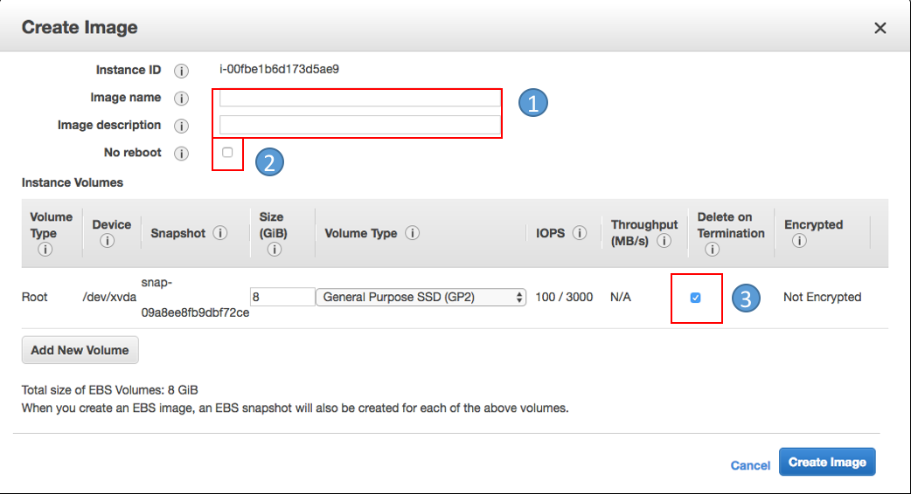

## AMI (Amazon Machine Image)

### AMI 생성

1. https://console.aws.amazon.com/ec2/에서 Amazon EC2 콘솔을 엽니다.
2. 왼쪽 탐색 창 메뉴의 [**인스턴스**]에서 [**인스턴스**] 클릭
3. 인스턴스 목록 중에서 **AMI** 이미지를 만들 인스턴스 선택
4. 인스턴스를 마우스 오른쪽 버튼으로 클릭하여 [**이미지**]>[**이미지 생성**] 메뉴 선택
5. 다음 정보 입력후, [**이미지 생성**] 클릭
	
	
	1. Image 이름과 설명을 간단히 입력
	2. 디스크 데이터 무결성을 확보하기 위해 이미지 생성 도중 리부트. 선택시, 리부트 되지 않으나, 데이터 무결성을 보장할 수 없음
	3. AMI 이미지는 EC2인스턴스와 별도의 객체로 저장됨. EC2인스턴스 삭제시 같이 제거하려면 체크함.

### AMI 생성 과정
1. EC2 인스턴스 리부트
2. EC2 인스턴스의 스냅샷 생성
	- 왼쪽 탐색 창 메뉴의 [**ELASTIC BLOCK STORE**]- [**스냅샷**] 클릭하여 생성된 스냅샷 확인할 수 있음
3. 생성된 스냅샷을 이용하여 AMI 이미지 생성
	- 왼쪽 탐색 창의 [**이미지**]- [**AMI**] 클릭하여 생성된 이미지 확인할 수 있음

### 이용자 정의 AMI로 EC2 인스턴스 생성하기
1. 방금 만든 AMI 이미지를 선택한 다음 [**시작**] 버튼을 클릭
2. [**인스턴스 유형 선택**] 페이지에서 인스턴스의 하드웨어 구성을 선택할 수 있습니다. 기본적으로 선택된 *t2.micro* 유형을 선택후, [**다음: 인스턴스 세부 정보 구성**]를 클릭
3. [**인스턴스 세부 정보 구성**] 페이지의 ‘**서브넷**’ 메뉴에서 기존 인스턴스와 다른  가용영역 선택후, [**검토 및 시작**]를 클릭
4. [**검토 및 시작**] 화면에서 ‘**보안 그룹 편집**’를 클릭
5. [**보안 그룹 편집**] 페이지에서 [**기존 보안 그룹 선택**] 항목을 선택하여 이전에 설정하였던 보안그룹(Security Group)으로 변경하고, [**검토 및 시작**] 클릭
6. [**인스턴스 시작 검토**] 페이지에서 [**시작**]를 선택
7. 키 페어에 대한 메시지가 나타나면 [**기존 키 페어 선택**]를 선택한 다음 이전에 인스턴스 설치할 때 생성한 키 페어를 선택 
	- 승인 확인란을 체크한 다음 [**인스턴스 시작**]를 선택
8. [**인스턴스 보기**]를 선택하여, [**인스턴스**] 화면에서 시작 상태를 볼 수 있음

 
	 
