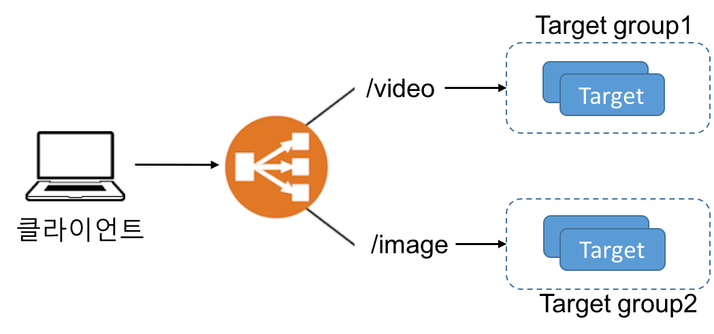
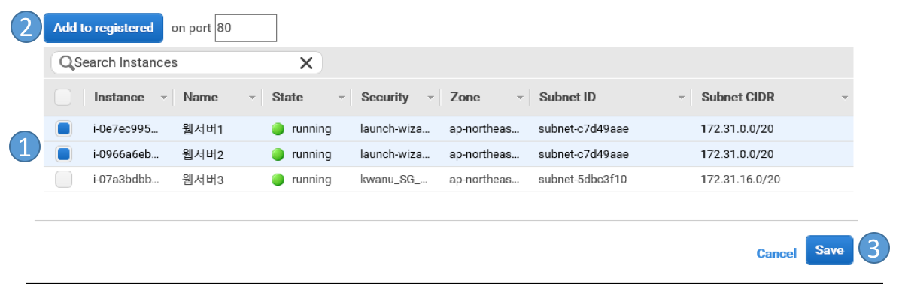
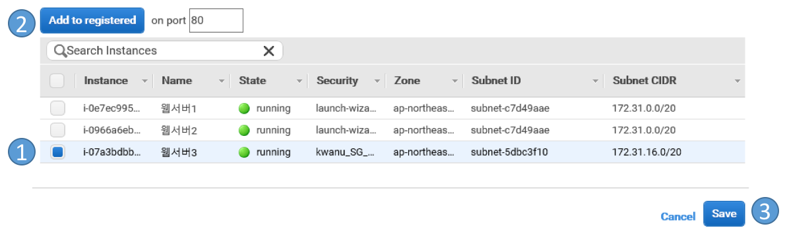
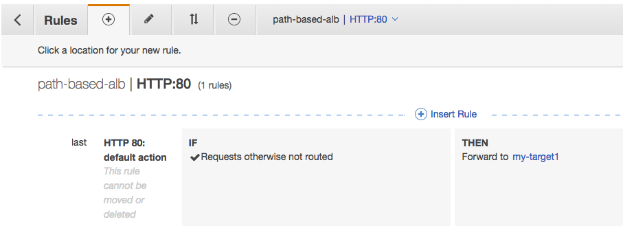
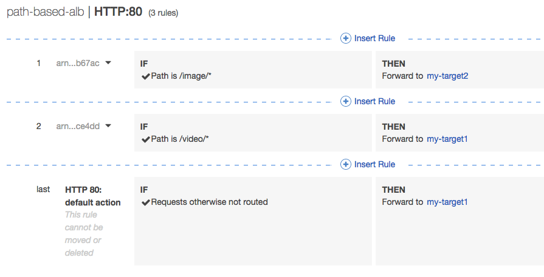

## Elastic Load Balancing

### 로드 밸런싱이란?

- “In computing, load balancing improves the distribution of workloads across multiple computing resources, such as computers, a computer cluster, network links, central processing units, or disk drives…” (https://en.wikipedia.org/wiki/Load_balancing_(computing))

	

### Elastic Load Balancing (ELB) 란?

- **ELB**는 AWS에서 제공하고 있는 로드 밸런싱 서비스
	- 하나 이상의  가용영역에 있는 EC2인스턴스에 애플리케이션 트래픽을 분산시킴으로써 애플리케이션의 결함포용성을 증진시킴
	- 로드 밸런서는 클라이언트를 위한 단일 접촉점 역할
	- 로드 밸런서에 EC2인스턴스를 필요에 따라 추가 혹은 삭제 할 수 있음
	- 로드 밸런서는 등록된 인스턴스의 건강상태를 검사하여, 건강한 인스턴스에만 클라이언트 요청을 전송.
	- 건강에 문제있는 인스턴스가 다시 건강한 상태가 되면 로드 밸런서는 다시 클라이언트 요청을 전송
	- 로드 밸런서는 암호화/복호화 작업을 인스턴스 대신에 수행하여 인스턴스가 본연의 업무에 집중할 수 있도록 해줄수 있음

- 타입
	- 클래식 로드 밸런서 (	Classic Load Balancer) – ELB version1
	- 애플리케이션 로드 밸런서 (Application Load Balancer) – ELB version2
	- 네트워크 로드 밸런서 – ELB version2

- [Elastic Load Balancing 제품 비교](https://aws.amazon.com/ko/elasticloadbalancing/details/#compare)

### 가용 영역 및 로드 밸런서 노드
- 로드 밸런서에서 가용 영역을 활성화하면 Elastic Load Balancing이 해당 가용 영역에서 로드 밸런서 노드를 생성
	- 가용 영역에 대상을 등록하였지만 가용 영역이 활성화되지 않는 경우 등록된 대상은 트래픽을 수신하지 않음
	- 여러 개의 가요 영역을 활성화하는 것이 좋음
	- 가용 영역을 비활성화하면 해당 가용 영역의 대상은 로드 밸런서에 등록된 상태로 유지되지만 로드 밸런서는 대상으로 트래픽을 라우팅하지 않음
	
#### 교차 영역 로드 밸런싱
- 교차 영역 로드 밸런싱을 활성화하면 각 로드 밸런서 노드가 활성화된 모든 가용 영역에 있는 등록된 대상 간에 트래픽을 분산

	
	
- 교차 영역 로드 밸런싱이 비활성화된 경우 가용 영역 A에 있는 각 2개의 대상은 25%의 트래픽을 수신하고 가용 영역 B에 있는 각 8개의 대상은 트래픽의 6.25%를 수신	
	
	
- Application Load Balancer에서는 교차 영역 로드 밸런싱이 항상 활성화

### Internal Load Balancer vs. Internet Facing Load Balancer

- Internet Facing Load Balancer
	- 로드 밸런서의 DNS 이름과 공용 IP 주소가 대응되어 있어, 클라이언트 요청을 인터넷을 통해 로드 밸런서에 연결시킬 수 있음
- Internal Load Balancer
	- 로드 밸런서의 DNS 이름이 가상 네트워크 환경인 VPC (Virtual Private Cloud) 의 사설 IP주소에 대응되어 있어, VPC 로의 접근권한을 가진 클라이언트의 요청을 VPC 내의 로드 밸러서를 통해 내부 인스턴스로 전달

## 1. 클래식 로드 밸런서
- 클라이언트로부터의 요청을 다중의 가용영역에 위치한 다중의 EC2 인스턴스로 분배

	

- **리스너 (Listener)**
	- 로드 밸런서에 설정된 프로토콜과 포트로의 클라이언트 연결 요청을 검사
	- 클라이언트 연결 요청을 등록된 인스턴스들에 설정된 프로토콜과 포트를 통해 전달
	- 로드 밸랜서에 하나 이상의 리스너 등록 가능
- **헬스 체크 (Health Check)**
	- 등록된 인스턴스들의 건강상태를 모니터링
	- 로드 밸런서는 오직 정상적인 인스턴스에만 요청을 보냄

	

### 1.1 [자습서: 클래식 로드 밸런서 생성](https://docs.aws.amazon.com/ko_kr/elasticloadbalancing/latest/classic/elb-getting-started.html)

### 1.2 [고정 세션 구성](https://docs.aws.amazon.com/ko_kr/elasticloadbalancing/latest/classic/elb-sticky-sessions.html)

## 2. 애플리케이션 로드 밸런서
- 리스너
	- 클라이언트로부터의 연결 요청을 설정된 프로토콜과 포트를 이용해 검사하고, 하나 이상의 대상 그룹에 연결 요청을 설정된 규칙에 따라 전달
		- 규칙: 대상 그룹, 조건, 우선순위 
- 대상 그룹 (Target Group)
	- 설정된 프로토콜과 포트 번호를 사용해 등록된 대상들에 요청을 전달
	- 하나의 대상이 여러 대상 그룹에 등록될 수 있음
	- 헬스 체크는 대상 그룹별로 설정되며, 등록된 모든 대상에 대해서 헬스 체크를 수행

- 클래식 로드 밸런서 대비 애플리케이션 로드 밸런서의 이점
	- 경로 기반 라우팅을 지원
	- 호스트 기반 라우팅을 지원
	- 단일 EC2 인스턴스의 여러 애플리케이션으로 요청을 라우팅하는 것을 지원

### 2.1 [Application Load Balancer 시작하기](https://docs.aws.amazon.com/ko_kr/elasticloadbalancing/latest/application/application-load-balancer-getting-started.html)

### 2.2 경로 기반 라우팅 실습
- 개념
	- URL 경로를 기반으로 클라이언트 요청을 전달
	- URL 경로를 기반으로 라우팅하는 규칙을 리스너에 추가

	

- **사전준비**
	- 두개의 다른 가용영역에서 있는 3개의 EC2인스턴스들을 준비한다
		- 하나의 가용영역은 2개의 EC2 인스턴스 
		- 다른 하나의 가용영역은 1개의 EC2 인스턴스
	- 각 인스턴스들의 웹서버 문서 루트(/var/www/html/) 하위에 다음 두 파일 생성
		- index.html - 인스턴스의 메인 홈페이지
		- /video/index.html – 인스턴스 별로 각 파일의 콘덴츠를 별도로 정의
		- /image/index.html - 인스턴스 별로 각 파일의 콘덴츠를 별도로 정의
	- 하나의 가용영역에서 있는 2개의 인스턴스를 실행
		- 이 두개의 인스턴스는 my-target1의 대상 그룹에 등록될 것임
	- 다른 하나의 가용영역에 있는 1개의 인스턴스를 실행
		- 이 인스턴스는 이번 실습에서 my-target2의 대상 그룹에 등록될 것임
	- EC2 인스턴스의 보안그룹이 80 포트의 HTTP 접근을 허용하는지 확인
	- 아파치 웹서버 설치 및 실행하여, 웹서버의 웹페이지가 EC2 인스턴스의 DNS 이름으로 로드되는지 확인

- **단계1: 첫번째 대상그룹 생성**
	1. 왼쪽 탐색창 메뉴의 [**LOAD BALANCING**]의 [**대상 그룹(Target Groups)**] 선택
	2. [**대상 그룹 생성(Create target group)**] 클릭
		- [**대상 그룹 이름(Target group name)**] 에서 대상 그룹 이름 지정 (예, *my-target1*)
		- 나머지 항목(프로토콜, 포트, 대상 유형, VPC, 상태 검사 설정(프로토콜, 경로))은 기본값 유지
		- [**생성e**] 클릭
	3. 새롭게 생성된 대상 그룹 (*my-target1*)을 선택
	4. [**대상(Targets)**] 탭의 [**편집(Edit)**] 클릭
	5. 하나이상의 인스턴스를 선택하고, [**등록된 항목에 추가(Add to registered)**] 클릭 후, [**저장(Save)**] 클릭
	
	
	
- **단계2: 두번째 대상그룹 생성**
	2. [**대상 그룹 생성(Create target group)**] 클릭
		- [**대상 그룹 이름(Target group name)**] 에서 대상 그룹 이름 지정 (예, *my-target2*)
		- 나머지 항목(프로토콜, 포트, 대상 유형, VPC, 상태 검사 설정(프로토콜, 경로))은 기본값 유지
		- [**생성**] 클릭
	3. 새롭게 생성된 대상 그룹 (*my-target2*)을 선택
	4. [**대상(Targets)**] 탭의 [**편집(Edit)**] 클릭
	5. 하나이상의 인스턴스를 선택하고, [**등록된 항목에 추가(Add to registered)**] 클릭 후, [**저장(Save)**] 클릭
	
	
	
- **단계3:로드 밸런서 타입 선택**
	1. 왼쪽 탐색 창 매뉴의 [**LOAD BALANCING**]에서 [**로드밸런서(Load Balancers)**]를 선택
   2. [**로드 밸런서 생성(Create Load Balancer)**] 클릭
	3. **Application Load Balancer**의 **생성**를 클릭
- **단계4: 로드 밸런서 구성**
	1. [**이름**] : 이름 입력 (해당 리전에서 고유한 이름): 예, *path-based-alb*
	1. [**방식**]: 기본값 유지 (*인터넷 연결*)
	3. [**IP 주소 유형**]: 기본값 유지 (*ipv4*)
	4. [**리스너**]: 기본값 유지 (프로토콜 : HTTP, 포트: 80)
	5. [**가용 영역**]: 
		- VPC를 선택: 기본 VPC 선택 유지
		- 두개 이상의 가용 영역의 서브넷 선택 
	6. [**Next: 보안 설정 구성**] 클릭
- **단계 5: 로드 밸런서에 보안그룹 할당** 
	1. [**단계 3: 보안 그룹 구성**] 화면에서 [**기본 보안 그룹 선택**] 항목 선택
	2. 이전 실습에서 사용했던 보안그룹 선택
	3. [**Next: 라우팅 구성**] 클릭
- **단계 6: 라우팅 구성**
	1. [**단계 4: 라우팅 구성**] 화면에서 다음 설정
		- [**대상 그룹**] : Existing target group 선택
		- [**이름**]: 첫번째 대상 그룹 (*my-target1*) 선택
		- 나머지 항목은 기본값 그대로 사용
	2. [**다음: 대상 등록**] 클릭
	3. [**단계 5: 대상 등록**] 화면에서, [**다음: 검토**] 클릭
	4. [**단계 6: 검토**] 화면에서, [**생성**] 클릭
	5. 로드밸런서가 성공적으로 생성되었으면, [**닫기**] 클릭
- **단계 7: 리스너 설정**
	1. 새롭게 생성된 로드 밸런서를 선택
	2. [**리스너**] 탭에서 생성된 리스너의 규칙을 보기 위해, [**규칙 보기/편집**] 클릭
	
	3. 화면 상단의 [**(+)**]을 클릭한 후, [**(+)Insert Rule**] 클릭
	
	
	4. 경로 기반 라우팅으로서 */video/**의 요청에 대해서 *my-target1*으로 전달하는 규칙 추가
		- 아래와 같이 설정후 [**Save**]선택 
		
	5. 같은 방법으로, 경로 기반 라우팅으로서 */image/**의 요청에 대해서 *my-target2*으로 전달하는 규칙 추가
	6. 두개의 규칙을 추가 한 후의 결과
		

- **단계 8: 테스트**
	1. 왼쪽 탐색 창 메뉴의 [**LOAD BALANCING**]의 [**로드 밸런서**]를 선택
	2. [**설명**] 탭에서 로드밸런서의 DNS 이름 값을 복사해서 웹브라우저에서 테스트

		- 아래의 주소를 입력후, 새로고침을  3번이상 수행하여 결과를 확인
			- http://path-based-elb-xxx.elb.amazonaws.com/video/ 
				- my-target1 대상 그룹의 인스턴스들이 Response
			- http://path-based-elb-xxx.elb.amazonaws.com/
				- my-target1 대상 그룹의 인스턴스들이 Response
			- http://path-based-elb-xxx.elb.amazonaws.com/image/ 
				- my-target2 대상 그룹의 인스턴스들이 Response

			- 위의 (path-based-elb-xxx.elb.amazonaws.com) 주소는 로드밸런서의 DNS name 값 임

 
