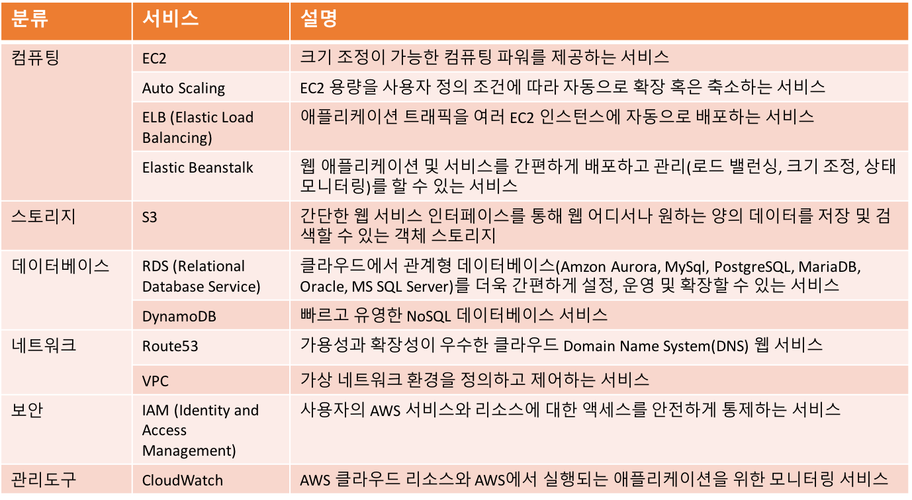

## AWS 소개

### 아마존 웹 서비스 (AWS) 등장 배경
- AWS 등장 이전 
	- **Salesforce.com** 서비스
		- 1999년 기업용 CRM (Customer Relationship Management) 서비스를 SaaS 형태로 제공
		- 클라우드 서비스의 첫번째 이정표

- AWS 등장
	- 아마존은 1995년에 설립된 인터넷 전자상거래 전문 회사
	- 고도의 확장성과 안전성을 지원하는 웹 애플리케이션 운영 능력 확보한 아마존은 2006년 AWS (Amazon Web Service)라는 클라우드 전문 자회사 설립하고, EC2 (Elastic Compute Cloud)라는 IaaS 서비스 출시
	- 사업 시작 후 5년 만에 40배 이상의 매출 증가

- AWS 등장 이후
	- IT 자원의 "**소유**" 에서 "**접속**"으로 패러다임 변화

### AWS 소개 동영상

<iframe width="560" height="315" src="https://www.youtube.com/embed/jOhbTAU4OPI" frameborder="0" allow="autoplay; encrypted-media" allowfullscreen></iframe>

- 소매점이나 부동산에서 금융 데이터나 사진을 가지고 작업을 할 때, 당신의 사업은 필요에 따라 증가되는 비용을 안정적이고 안전하게 운영하는 애플리케이션에 의존하게 됩니다. AWS는 이러한 애플리케이션을 개발하고 운영하는데 필요한  클라우드 컴퓨팅 서비스의 전체 집합을 인터넷을 통해 제공해 줍니다. 
- AWS에서는 필요한 IT 리소스를 빨리, 막대한 자금 투자 없이 공급할 수 있도록, Compute, Storate, Database 서비스를 제공해 줍니다.
전통적인 데이터 센터에서 일어나는 꽤 많은 것들이 AWS에서 가능하지만, 모든 서비스는 선행 자금 투자 없이 “pay-as-you-go (사용한 만큼 지불)” 기반으로 사용 가능합니다.
대신에, 사용하는 동안만 지불하게 될 내구성이 높은 스토리지 서비스, 낮은 대기시간의 데이터베이스, 일련의 애플리케이션 개발 도구들을 찾을 수 있을 것입니다.
- AWS는 190여 개국에 걸쳐 수백, 수천의 고객을 가지고 있기 때문에, 막강한 리소스를 적은 운영 비용으로 제공하는 규모 경제의 이익을 얻을 수 있습니다.
용량 계획이 또한 더 쉽게 됩니다. 전통적인 데이터 센터에서는 새로운 애플리케이션의 론칭이 다소 모험적 일 수 있습니다. 너무 많은 서비스를 제공하면 시간과 돈의 낭비를 초래할 수 있고, 너무 적게 제공하면, 고객에게 최고의 경험을  제공하지 못할 것입니다.
용량을 탄력적으로 추가하고 제거하는 능력으로부터, 당신의 애플리케이션은 당신 고객의 요구를 만족시키기 위해서 확장될 수 있고, 돈을 절약하면서 다시 빨리 축소될 수 있습니다.
- 우리가 공급 IO 성능과 내구성 통계에 대해서 온종일 고객과 얘기하면, 고객이 말하길 가장 큰 성능 향상은 혁신적인 새로운 기능을 시장에 좀더 빨리 출시하는 팀의 능력에서부터 나온다고 합니다.
AWS를 가지고 개발팀은 서버를 설정하는 무거운 작업 대신에 고객을 위한 차별화된 가치를 추가하는데 좀더 초점을 둘 수 있습니다.
이것은 한때 불가능한 새로운 아이디어를 타당하게 만듦으로써 혁신을 이끄는 데 도움이 됩니다. 
실험은 빠르고 위험이 적고, 한때는 비용과 리소스에 의해서 제한적이었던 새로운 프로젝트를 시도하는 것이 가능하게 됩니다.
성공적인 실험은 빨리 생산에 진입할 수 있고, 부수적인 손상 혹은 진행되지 않았던 비용들과 함께 살 필요가 없습니다.
- 현재, 연결된 세상에서는 어떤 회사도 전세계의 최종 사용자를 가질 수 있습니다. 
모든 다중의 지역으로부터 AWS는 비즈니스들이 그들의 고객을 글로벌하게 서브하는데 도움을 줍니다. 비싼 시간 소모적인 물리적인 지역 확장의 필요 없이, 몇번의 클릭으로, 당신은 올리고 운영할 수 있을 것입니다. 
당신이 기술과 상호작용하는 방식을 아마존 웹서비스를 가지고 다시 개발하십시오.

### AWS 주요 서비스

 

