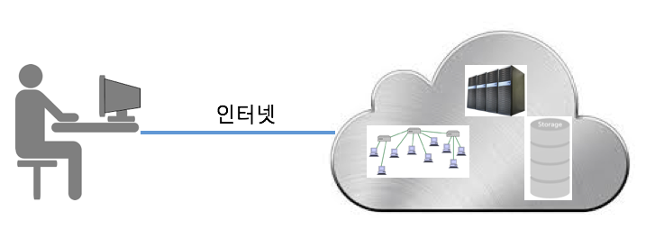
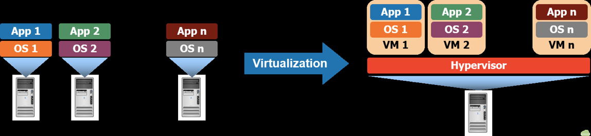
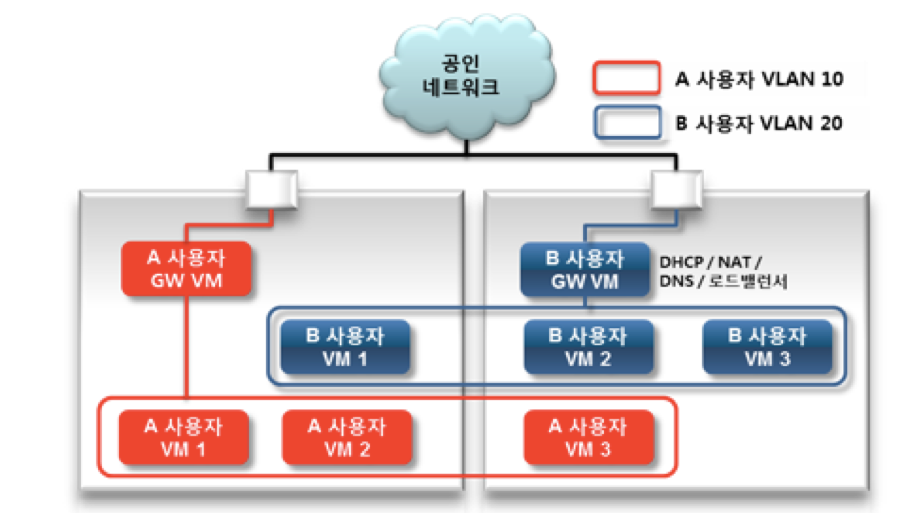
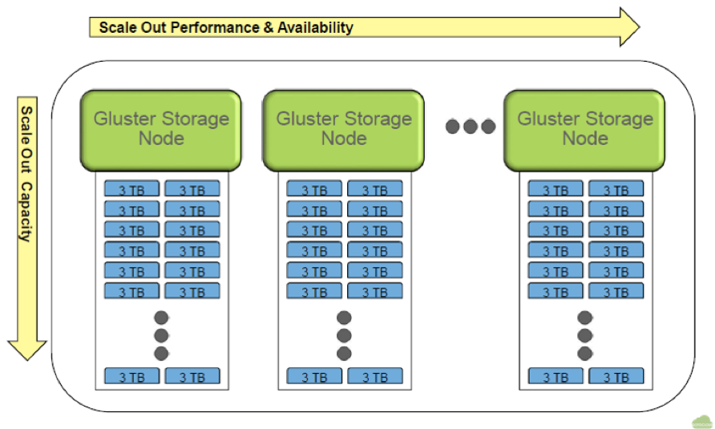

## 클라우드 컴퓨팅
---

### 클라우드 컴퓨팅이란?
- 다양한 IT 리소스와 애플리케이션을 필요에 따라 인터넷을 통해 제공하고 사용한 만큼만 비용을 지불하는 것

	- IT 리소스: 컴퓨팅 파워, 네트워크, 스토리지 등

	

---	
### 기반기술
- **서버 가상화** 
	- 서버 가상화는 독립적인 CPU, 메모리, 네트워크 및 운영 체제를 갖는 여러 대의 가상 머신(Virtual Machine)들이 물리적인 서버의 자원을 분할해서 사용하는 기술을 의미
	- 물리적 하드웨어 상에서 가상 머신에 대한 운영을 담당하는 플랫폼을 하이퍼바이저(Hypervisor)라고 통칭하며 VMM (Virtual Machine Monitor)라고도 부림

	
	
- **네트워크 가상화** 
	- 클라우드 환경에서는 다양한 사용자가 원하는 때에 원하는 IT 자원을 제공받게 되는데, 이 때 각 사용자 별로 네트워크를 격리하고 격리된 네트워크가 인터넷과 통신을 하도록 하는 가상 라우터가 가장 중요한 역할을 하게 된다.
	- 네트워크 격리 및 가상 라우터 지원을 포괄하는 기능을 **네트워크 가상화**라 함.
	
	
	
- **분산 스토리지**
	- 클라우드 스토리지 서비스는 사용자별로 일정량의 저장공간을 제공하는데, 단일 스토리지로는 대용량의 저장공간을 제공하는 것이 불가능하다.
	- 단일 스토리지를 네트워크로 연결하여 대용량의 저장 공간을 제공하는 분산 스토리지가 필요

	

---
### 클라우드 컴퓨팅의 서비스 모델
#### SaaS (Software as a Service)
- 응용 프로그램을 웹서비스 형태로 제공
- 예, Google Docs, Gmail, Salesforce.com의 CRM 서비스, Ecount ERP, 등

#### Paas (Platform as a Service)
- 응용 프로그램 개발자를 위한 서비스로, 개발자들이 기반 인프라스트럭처에 대해 신경을 쓰지 않고 앱을 개발하고 테스트할 수 있는 환경을 제공
- 예, Google Cloud Platform, Firebase, AWS Elastic Beanstalk, 등

#### IaaS (Infrastructure as a Service)
- 컴퓨팅 파워, 스토리지, 네트워크 등을 서비스 형태로 제공
- 예, AWS, Google Cloud, Azure, 등

---
### 클라우드 컴퓨팅 특징
- 요청에 의한 셀프 서비스
	- 소비자는 필요한 리소스를 스스로 준비할 수 있다.
- 광대역 네트워크를 통한 접근
- 리소스 풀링
	- 리소스는 풀(pool)을 형성하며, 소비자 요구에 의해 동적으로 할당/해지
	- 멀티 태넌트 모델을 통해 다수의 소비자에게 서비스
- 민첩한 탄력성
	- 리소스는 민첩하게 제공되었다가 해지될 수 있다.
- 측정될 수 있는 서비스
	- 서비스 수준을 측정해서 자동으로 리소스를 제어하거나 최적화할 수 있다.

---
### 클라우드 컴퓨팅의 이점
- 초기 인프라 자원 투자에 대한 부담 감소
- 빠른 인프라 구축을 통한 개발 라이프사이클 단축 
- 사용한 양에 따른 비용 구조
- 즉각적인 인프라 자원 확장
- 효율적인 자원 할당 및 관리
- 데이터 센터 운영 및 유지 관리에 비용 투자 불필요

