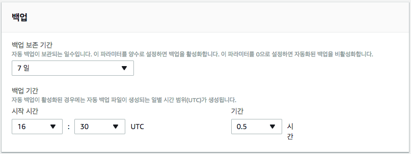
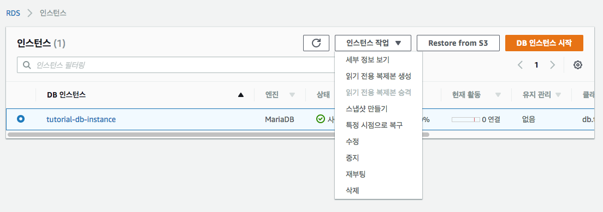
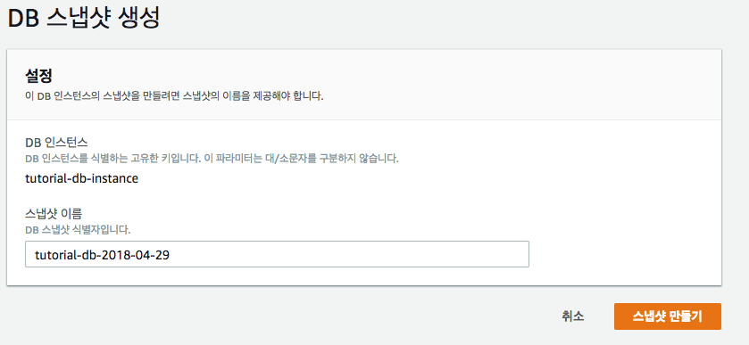
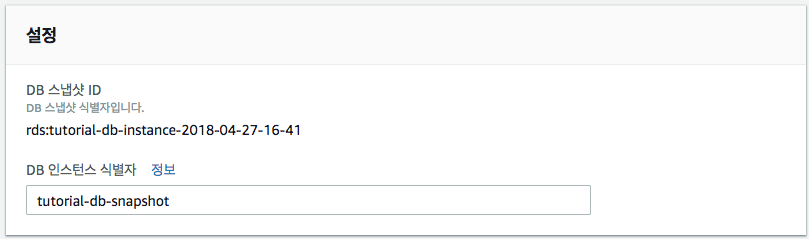
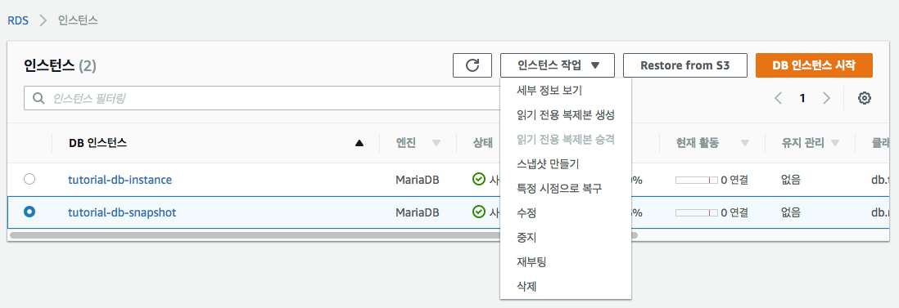
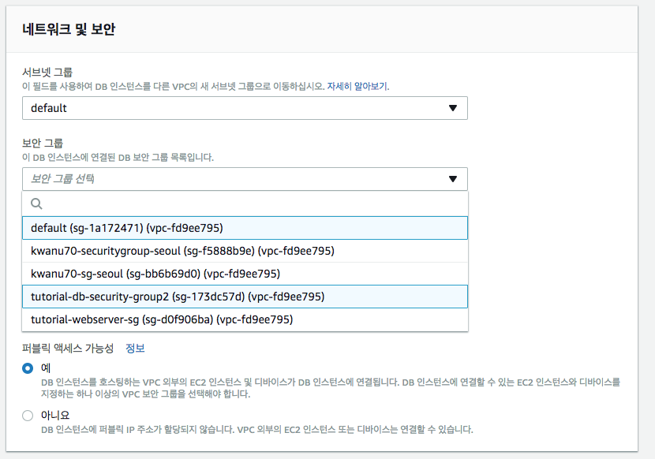
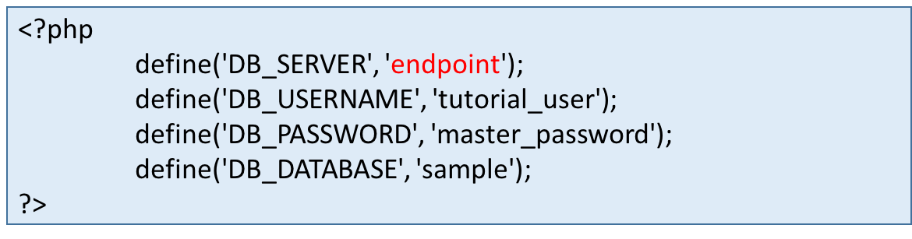
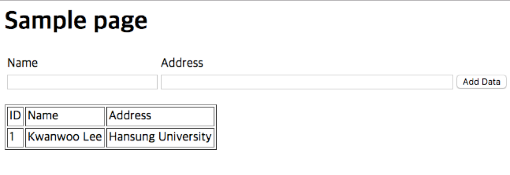

## 4. 백업과 복원

### 4.1 자동 백업 작업
- Amazon RDS는 사용자가 지정한 백업 보존 기간에 따라 DB 인스턴스의 자동 백업을 저장 
	- DB 인스턴스를 선택하고, [**인스턴스 작업**]-[**수정**] 선택하여 설정 변경가능

	

- 필요할 경우 백업 보존 기간 중 **어느 특정 시점으로**든 데이터베이스를 복구

	
	
- **백업 스토리지**
	- 각 리전의 Amazon RDS 백업 스토리지는 해당 리전의 **자동 백업 및 수동 DB 스냅샷으로 구성**
	- DB 인스턴스를 삭제하면 모든 자동 백업이 삭제
	- DB 인스턴스를 삭제한 후에는 자동 백업을 복구할 수 없음 
	- Amazon RDS가 DB 인스턴스를 삭제하기 전에 최종 DB 스냅샷을 생성하도록 선택한 경우 이 스냅샷을 사용하여 DB 인스턴스를 복구할 수 있음
	- 수동 스냅샷은 삭제되지 않음
- **백업 기간**
	- 자동 백업은 기본 백업 기간 동안 매일 실행
	- 백업 시간이 백업 기간에 할당된 시간보다 오래 걸릴 경우 백업은 백업 기간이 종료한 후에도 완료 시까지 계속 실행
	- 백업 기간은 해당 DB 인스턴스에 대한 **주간 유지 보수 기간과 겹칠 수 없음**
	- 자동 백업 기간 중에 백업 프로세스가 시작될 때 스토리지 I/O가 일시적으로 중단가능
		- MariaDB, MySQL, Oracle 및 PostgreSQL의 경우, 다중 AZ 배포에 대한 백업 시 기본 AZ에서는 I/O 작업이 중단되지 않음. (백업이 예비 복제본으로부터 수행)

### 4.2 DB 스냅샷 생성
- Amazon RDS는 개별 데이터베이스가 아닌 전체 DB 인스턴스를 백업하여 DB 인스턴스의 스토리지 볼륨 스냅샷을 생성
	- 단일 AZ DB 인스턴스에서 이 DB 스냅샷을 생성하면 잠시 I/O가 중단
	- 다중 AZ DB 인스턴스는 예비 인스턴스에서 백업이 이루어지기 때문에 이 I/O 중단 안됨

- DB 스냅샷을 생성하는 방법
	1. AWS Management Console에 로그인한 다음 https://console.aws.amazon.com/rds/에서 **Amazon RDS 콘솔**을 엽니다.
	2. 탐색 창에서 **인스턴스**를 클릭합니다.
	3. DB 인스턴스를 선택하고,[**인스턴스 작업**]과 [**스냅샷 만들기**]을 차례대로 클릭합니다.
	4. [**DB 스냅샷 생성**] 창이 나타납니다.
	5. [**스냅샷 이름**] 텍스트 상자에 스냅샷 이름을 입력합니다.

	
	
### 4.3 DB 스냅샷에서 복원
- DB 인스턴스를 복원하는 경우 복원 원본으로 사용할 DB 스냅샷의 이름을 입력하고 이 복원에서 생성되는 새 DB 인스턴스의 이름을 입력
	- DB 스냅샷에서 기존 DB 인스턴스로 복원할 수는 없고, **복원할 때 새 DB 인스턴스가 생성됨**
	- DB 인스턴스를 복원할 경우 기본 DB 파라미터와 보안 그룹만 복원된 인스턴스와 연결됨
	- **복원이 완료되는 즉시 복원의 원본 인스턴스에서 사용하는 사용자 지정 DB 파라미터 또는 보안 그룹을 연결**해야 함

- DB 스냅샷에서 DB 인스턴스 복원 방법
	1. 탐색 창에서 [**스냅샷**]를 선택합니다.
	2. 복원 원본으로 사용할 DB 스냅샷을 선택합니다.
	3. [**인스턴스 작업**]과 [**스냅샷 복원**]을 선택합니다.
	4. [**DB 인스턴스 식별자**] 텍스트 상자에 복원된 DB 인스턴스의 이름을 입력후, [**DB 인스턴스 복원**] 선택

		
		
		- 스냅샷으로부터 복원되는 DB 인스턴스가 생성되는 데는 시간이 다소 걸림
		
	5. 복원된 DB 인스턴스를 선택하고, [**인스턴스 작업**]-[**수정**] 선택

		
	
	6. [**네트워크 및 보안**]의 [**보안 그룹**]을 복원원본에서 사용한 보안그룹으로 설정

		

	7. [**계속**] 클릭
	8. [**DB 인스턴스 수정**] 클릭

### 4.4 스냅샷 복원 확인
- EC2 인스턴스의 /var/www/inc 디렉토리에 있는 dbinfo.inc 파일 콘텐츠의 endpoint 값을   스냅샷으로부터 복원된 DB 인스턴트의 DNS 주소로 대체

	
	
- 웹 서버를 열고 http://EC2 instance endpoint/SamplePage.php (예: http://ec2-52-79-51-167.ap-northeast-2.compute.amazonaws.com/SamplePage.php) 를 검색하여 웹 서버에서 RDS MariaDB DB 스냅샷 인스턴스에 제대로 연결되는지 확인

	
