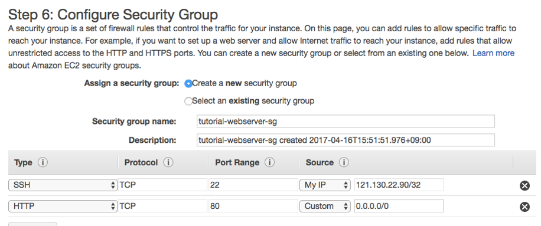
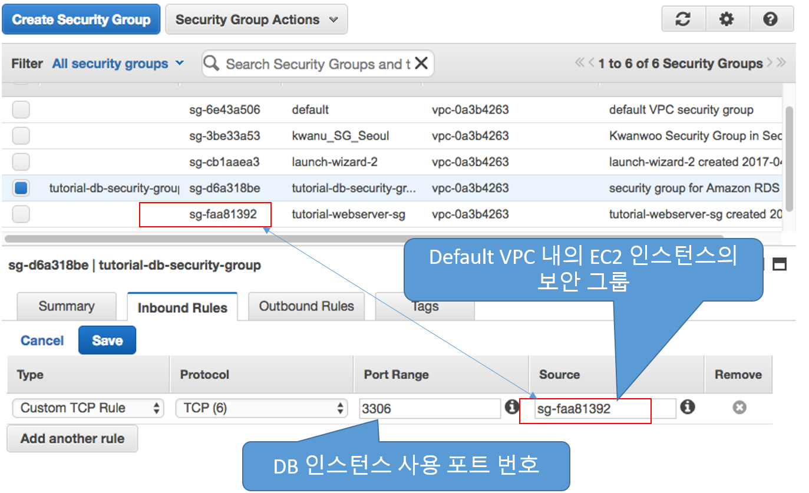
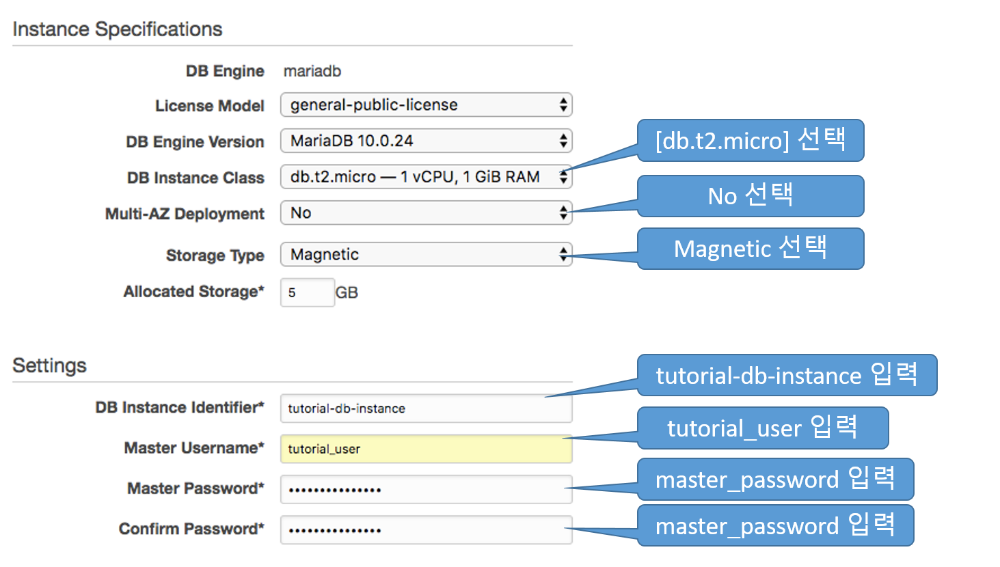
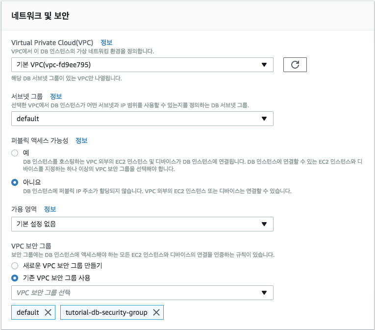
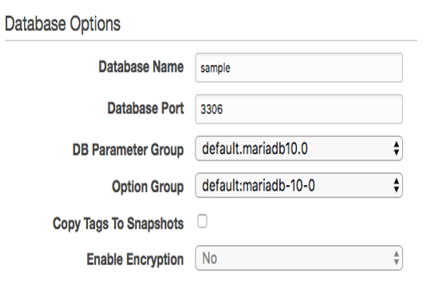
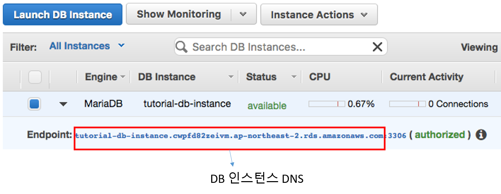
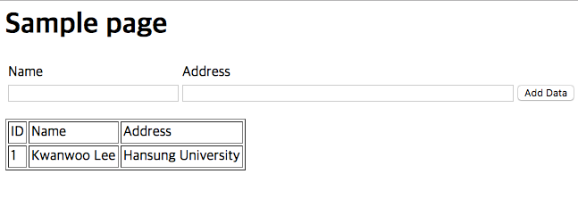

## 2. 실습: MariaDB DB 인스턴스 생성 및 웹서버 생성
- 사전준비
  1. [EC2 인스턴스 생성](#0.1)
  2. [PHP와 함께 Apache 웹서버 설치](#0.2)
  3. [VPC 보안 그룹 생성](#0.3)

1. [MariaDB DB인스턴스 생성](#1)
2. [DB 인스턴스에 PHP 웹 애플리케이션 연결](#2)
3. [DB인스턴스의 데이터베이스에 연결](#3)
4. [DB 인스턴스 삭제](#4)

---
<a name="0.1"></a>
### 사전준비-1. EC2 인스턴스 생성
1. AWS Management Console에 로그인한 다음 https://console.aws.amazon.com/ec2/ 에서 Amazon EC2 콘솔을 엽니다
2. [EC2 Dashboard]를 선택한 다음, [Launch Instance]를 선택합니다
3. [Amazon Linux] Amazon 머신 이미지(AMI)를 선택합니다.
4. [t2.micro] 인스턴스 유형을 선택한 다음, [Next: Configure Instance Details]를 선택합니다.
5. [Configure Instance Details] 페이지에서 다음과 같이 값을 설정하고 다른 값은 기본값으로 유지합니다.
  - Network: VPC (default)
  - Subnet: 기존 디폴트서브넷
  - Auto-assign Public IP: Enable
6. [Next: Add Storage]를 선택합니다.
7. Add Storage 페이지에서 기본값을 유지하고 [Next: Add Tags]를 선택합니다.
8. [Add Tags] 페이지에서 [Add tag]를 클릭후에, [Key] 를 [*Name*]으로 [Value]를 [*tutorial-webserver*]로 설정한 다음, [Next: Configure Security Group]을 선택합니다.
9. [Configure Security Group] 페이지에서 다음과 같이 [Create a new security group]을 선택한 후,
  - [Security group name] 으로 [*tutorial-webserver-sg*]
  - SSH 및 HTTP 액세스를 위한 인바운드 규칙을 정의
  - [Review and Launch] 클릭

  

10. [Review Instance Launch] 페이지에서 설정을 확인한 다음 [Launch]를 선택합니다.
11. [Select an existing key pair or create a new key pair] 페이지에서 [Create a new key pair]를 선택하고 [Key pair name]을 [*tutorial-key-pair*]로 설정합니다. [Download Key Pair]를 선택하고 로컬 시스템에 키 페어 파일을 저장합니다. 이 키 페어 파일을 사용하여 EC2 인스턴스에 연결하게 됩니다.
12. EC2 인스턴스를 시작하려면 [Launch Instances]를 선택합니다.
13. 인스턴스를 찾으려면 [View Instances]를 선택합니다.
14. 인스턴스의 [Instance Status]가 running으로 읽힐 때까지 기다린 다음 계속합니다.

---
<a name="0.2"></a>
### 사전준비-2. PHP와 함께 Apache 웹서버 설치

1. EC2 인스턴스에 연결하고 PHP가 포함된 Apache 웹 서버를 설치한다.
  - 최신 버그 수정 및 보안 업데이트를 수행

    ```
    [ec2-user ~]$ sudo yum update –y
    ```

  - 업데이트 완료 후 yum install 명령을 사용하여 PHP 소프트웨어 패키지가 포함된 Apache 웹 서버를 설치

    ```
    [ec2-user ~]$ sudo yum install -y httpd24 php56 php56-mysqlnd     
    ```

  - 웹 서버를 시작

    ```
    [ec2-user ~]$ sudo service httpd start
    ```

  - chkconfig 명령을 사용하여 웹 서버가 시스템 부팅 때마다 시작되도록 구성

    ```
    [ec2-user ~]$ sudo chkconfig httpd on
    ```

2. Apache 웹 서버에 대한 파일 권한을 설정한다.
  - 사용자(이 경우는 ec2-user)를 apache 그룹에 추가

    ```
    [ec2-user ~]$ sudo usermod -a -G apache ec2-user
    ```

  - 로그아웃

    ```
    [ec2-user ~]$ exit
    ```

  - apache 그룹의 멤버십을 확인하려면 인스턴스에 다시 연결한 후 다음 명령을 실행.

    ```
    [ec2-user ~]$ groups
    ec2-user wheel apache
    ```

  - /var/www 및 그 콘텐츠의 그룹 소유권을 apache 그룹으로 변경

    ```
    [ec2-user ~]$ sudo chown -R ec2-user:apache /var/www
    ```

  - 그룹 쓰기 권한을 추가하여 나중에 하위 디렉터리에 대한 그룹 ID를 설정하려면 /var/www와 그 하위 디렉터리의 디렉터리 권한을 변경

    ```
    [ec2-user ~]$ sudo chmod 2775 /var/www
    [ec2-user ~]$ find /var/www -type d -exec sudo chmod 2775 {} \;
    ```

  - 그룹 쓰기 권한을 추가하려면 /var/www 및 그 하위 디렉터리의 파일 권한을 반복하여 변경

    ```
    [ec2-user ~]$ find /var/www -type f -exec sudo chmod 0664 {} \;
    ```

---
<a name="0.3"></a>
### 사전준비-3. VPC 보안그룹 생성
- DB 인스턴스는 VPC에서 생성될 가능성이 가장 높습니다
- VPC 보안 그룹을 생성하여 VPC 내부의 DB 인스턴스에 대한 액세스를 제공
- 절차
  1. AWS Management Console에 로그인한 후 https://console.aws.amazon.com/vpc 에서 Amazon VPC 콘솔을 엽니다.
  2. AWS Management Console 상단 오른쪽 모서리에서 VPC 보안 그룹과 DB 인스턴스를 생성할 리전을 선택
  3. 탐색 창에서 Security Groups를 클릭
  4. Create Security Group을 클릭
  5. [Create Security Group] 창에서 보안 그룹의 Name 태그, 그룹 이름 및 설명을 입력합니다.

    	- [Name 태그] : *tutorial-db-security-group*
    	- [그룹 이름] : *tutorial-db-security-group*
		- [설명]: *security group for tutorial db*
    	- DB 인스턴스를 생성하려는 VPC를 선택합니다. 
    	- [Yes, Create]를 클릭


  6. 콘솔 화면 하단 세부 정보 창에 보안 그룹 세부 정보를 비롯해 인바운드 및 아웃바운드 규칙 작업에 대한 탭이 표시됩니다. [Inbound Rules] 탭을 클릭.
  7. Inbound Rules 탭에서 [Edit]를 클릭
    	- [Custom TCP Rule]을 [Type] 목록에서 선택
    	- [PortRange] 텍스트 상자에 DB 인스턴스에 사용할 포트 값(3306)을 입력
    	- [Source] 텍스트 상자에 인스턴스에 액세스하는 위치의 IP 주소 범위(CIDR 값)를 입력하거나, 보안 그룹 이름을 선택 (DB인스턴스에 접속하는 애플리케이션의 EC2인스턴스의 보안그룹 이름 선택)
    

	8. 모두 마쳤으면 [Save]를 클릭합니다

---
<a name="1"></a>
### 단계 1: MariaDB DB인스턴스 생성

1. AWS Management Console에 로그인한 다음 https://console.aws.amazon.com/rds/ 에서 Amazon RDS 콘솔을 엽니다
2. Amazon RDS 콘솔의 오른쪽 위 모서리에서 DB 인스턴스를 만들 리전을 선택
3. 탐색 창에서 [인스턴스]를 선택
4. [DB 인스턴스 시작]를 선택합니다. 
5. [엔진 선택] 페이지에서 **MariaDB**를 선택하고 [다음 단계]를 클릭
6. [사용 사례 선택] 페이지에서 *개발/테스트 - MarialDB* 선택하고 [다음 단계]를 클릭
7. [DB 세부 정보 지정] 페이지에서 DB 인스턴스 정보를 지정
  - 라이선스 모델: 기본값
  - DB 엔진 버전: 사용하려는 MariaDB 버전을 선택
  - DB 인스턴스 클래스: [db.t2.micro] 선택
  - 다중 AZ 배포: *아니오* 선택
    - 장애 조치를 위해 다른 가용 영역에 DB 인스턴스의 예비 복제본을 생성하려면 Yes를 선택
  - 스토리지 유형 : *범용(SSD)*을 선택
  - 할당된 스토리지 : 20GB 할당
  - DB 인스턴스 식별자 : 선택한 리전의 계정에 대해 고유한 DB 인스턴스의 이름을 입력
  		- 예, *tutorial-db-instance*	
  - 마스터 사용자 이름 : 1-16자의 영숫자 문자를 사용해 DB 인스턴스에 로그온하기 위해 마스터 사용자 이름으로 사용할 이름을 입력
  		- 예, *tutorial_user*
  - [마스터 암호] 및 [암호 확인]: 마스터 사용자 암호로 인쇄 가능한 ASCII 문자(/, " 및 @ 제외) 8-41자를 포함하는 암호를 입력
  		- 예, *master_password*
  - [다음 단계] 클릭
<!--
    
-->
8. [고급 설정 구성] 페이지에서 RDS에서 MariaDB DB 인스턴스를 시작하는 데 필요한 추가 정보를 입력
  - VPC : MariaDB DB 인스턴스를 호스팅할 Amazon VPC의 이름을 선택
    	- *기본 VPC* 선택
  - 퍼블릭 액세스 가능성: VPC 외부에서 접근가능하게 할지 결정
    	- *아니오* 선택
  - 가용 영역: 특정 가용 영역의 지정 여부를 결정
    	- *기본 설정 없음* 선택
  - VPC 보안 그룹 : 이 DB 인스턴스에 사용할 VPC 보안 그룹을 선택
  		- 기존 보안 그룹(예: tutorial-db-security-group) 선택

    	

  - 데이터베이스 이름 : 기본 데이터베이스의 이름을 1~64자의 영숫자 문자로 입력 (*sample* 입력)
  - 데이터베이스 포트: 포트 *3306*로 설정
  - DB 파라미터 그룹: 기본값 [default.mysql10.0]을 유지
  - Option Group: [default.mariadb-10-0]의 기본값을 수락
  - [스냅샷으로 태그 복사]: 스냅샷을 생성할 때 DB 인스턴스 태그를 DB 스냅샷에 복사하려면 이 옵션을 체크

    	

  - [백업 보존 기간]: 데이터베이스에서 자동 백업을 지속할 일수를 설정
  - [백입 기간]: 데이터베이스를 백업할 특정 시간을 지정하지 않으려면 기본값으로 [*기본 설정 없음*]
  - 확장 모니터링: DB 인스턴스가 실행되는 운영 체제에 대한 실시간 수집 측정치를 활성화하지 않으려면 기본값인 [*확장 모니터링 사용 안함*]
  - [마이너 버전 자동 업그레이드 사용]: DB 엔진의 마이너 DB 엔진 버전 업그레이드가 제공되면 자동으로 이를 수신하도록 DB 인스턴스를 활성화하려면 선택
  - [유지 관리 기간]: 대기 중인 DB 인스턴스의 설정 변경을 적용하려면 30분으로 선택합니다. 이 시간이 중요하지 않은 경우 [*기본 설정 없음*]를 선택


9. [DB 인스턴스 시작]을 클릭
10. 다음 페이지에서 [DB 인스턴스 세부 정보 보기]를 선택하여 RDS DB 인스턴스를 확인
11. RDS 콘솔의 DB 인스턴스 목록에 새 DB 인스턴스가 나타남
  - DB 인스턴스를 만들고 사용할 준비가 될 때까지 DB 인스턴스의 상태는 **생성 중** 상태가 **사용 가능**으로 변경되면 DB 인스턴스의 데이터베이스에 연결할 수 있음.

    

---
<a name="2"></a>
### 단계2: DB인스턴스에 PHP 웹 애플리케이션 연결
1. EC2 인스턴스에  연결하고, 디렉터리를 **/var/www**로 변경하고, inc라는 새로운 하위 디렉터리를 생성합니다.

  ```
  [ec2-user ~]$ cd /var/www
  [ec2-user ~]$ mkdir inc
  [ec2-user ~]$ cd inc
  ```

2. dbinfo.inc라는 inc 디렉터리에서 새 파일을 생성한 다음 nano 또는 선택한 편집기를 호출하여 다음 콘덴츠로 파일을 편집하고 저장하고 닫는다.

  ```
  [ec2-user ~]$ >dbinfo.inc
  [ec2-user ~]$ nano dbinfo.inc
  ```

  ```
  <?php
  	define('DB_SERVER', 'endpoint');  \\ endpoint는 생성된 DB 인스턴스의 엔드포인트(포트 없음)로 대체
  	define('DB_USERNAME', 'tutorial_user');
  	define('DB_PASSWORD', 'master_password');
  	define('DB_DATABASE', 'sample');
  ?>
  ```

3. 디렉터리를 /var/www/html로 변경하고, SamplePage.php라는 html 디렉터리에서 새 파일을 생성한 다음 nano 또는 선택한 편집기를 호출하여 파일을 편집합니다

  ```
  [ec2-user ~]$ cd /var/www/html
  [ec2-user ~]$ >SamplePage.php
  [ec2-user ~]$ nano SamplePage.php
  ```

4. 다음 링크의 콘덴츠를 SamplePage.php 파일에 추가
  - https://github.com/kwanulee/AWSExample/blob/master/RDS-PHP/SamplePage.php

5. SamplePage.php 파일을 저장하고 닫습니다
6. 웹 브라우저를 열고 http://**EC2\_instance\_endpoint**/SamplePage.php 입력하여 결과를 확인   
  - 예: http://ec2-52-79-51-167.ap-northeast-2.compute.amazonaws.com/SamplePage.php 를 검색하여 웹 서버에서 RDS MariaDB DB 인스턴스에 제대로 연결되는지 확인

  

---
<a name="3"></a>
### 단계 3: MariaDB DB인스턴스의 데이터베이스에 연결
- 표준 SQL 클라이언트 애플리케이션을 사용해 DB 인스턴스에 있는 데이터베이스에 연결할 수 있습니다.
- mysql 명령줄 도구를 사용하여 DB 인스턴스의 데이터베이스에 연결하는 방법
  	1. MySQL이 설치된 EC2 인스턴스로 접속 혹은  MySQL 설치
   
   		```
   		[ec2-user ~]$ sudo yum install -y mysql56
   		```
  
  	2. 터미널에서 다음 입력
  
    	```
    	[ec2-user ~]$ mysql -h <endpoint> -P 3306 -u <mymasteruser> -p
    	```

    	- \<endpoint\>를  DB 인스턴스의 DNS 이름으로 대체 (port 번호 제외)
    	- \<mymasteruser\> 를 마스터 사용자 이름으로 대체

  3. 암호를 입력하라는 요청을 받으면 사용한 마스터 암호 입력

    	```
    	[ec2-user~]$ mysql -h tutorial-db-instance.cwpfd82zeivm.ap-northeast-2.rds.amazonaws.com -P 3306 -u tutorial_user -p
    	Enter password:
    	```

  4. 데이터베이스 확인

    	```
    	mysql> show databases;
    	```
  5. 데이터베이스 사용 선언

    	```
    	mysql> use sample;
    	```

  6. Select SQL문 사용

    	```
    	mysql>select * from Employees;
    	```

---
<a name="4"></a>
### 단계 4: DB 인스턴스 삭제
1. AWS Management Console에 로그인한 다음 https://console.aws.amazon.com/rds/ 에서 Amazon RDS 콘솔을 엽니다.
2. [Instances]에서 삭제할 DB 인스턴스를 선택합니다.
3. [Instance Actions]에 대해 [Delete]를 선택합니다.
4. [Create final Snapshot?]에 대해 [No]를 선택합니다.
5. [Yes, Delete]를 선택합니다.
