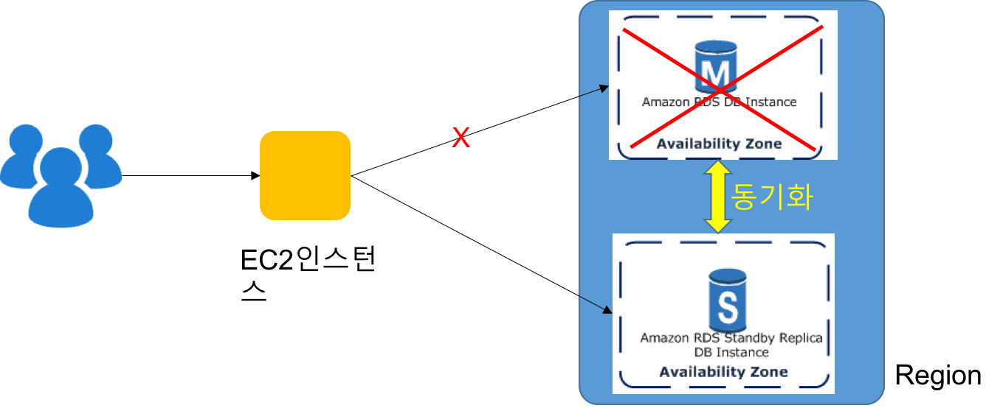
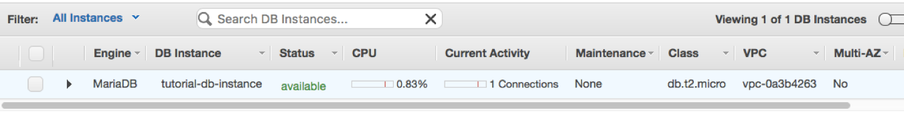
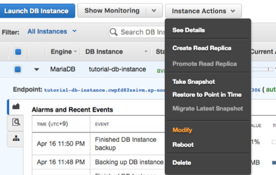
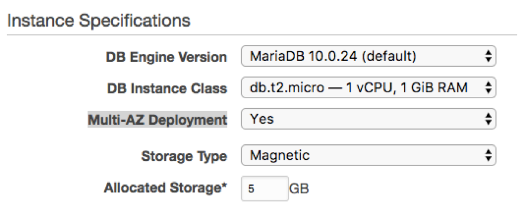
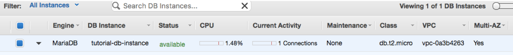

## 3. 고가용성 (다중 AZ) 설정

### 3.1 다중 AZ 개념
- Amazon RDS는 다중 AZ 배포를 사용해 DB 인스턴스에 고가용성과 장애 조치 기능을 지원
- 다중 AZ 배포에서 Amazon RDS는 자동으로 서로 다른 가용 영역에 동기식 예비 복제본을 프로비저닝하고 유지
	- 기본 DB 인스턴스는 가용 영역에서 예비 복제본으로 동기식으로 복제되어 데이터 이중화를 제공

### 3.2 Amazon RDS 장애 조치
- Amazon RDS는 자동으로 장애 조치를 취하여 관리자의 개입 없이 데이터베이스 작업을 신속하게 재개할 수 있도록 합니다

- 다음 상태가 발생하는 경우 기본 DB 인스턴스는 자동으로 예비 복제본으로 전환됩니다
	- 가용 영역 중단
	- 기본 DB 인스턴스 오류
	- DB 인스턴스 서버 유형 변경
	- DB 인스턴스의 운영 체제에서 소프트웨어 패치를 수행하는 중
	- 장애 조치 재부팅을 사용하여 DB 인스턴스에 수동 장애 조치가 취해진 경우

- 장애 조치에 소요되는 시간은 일반적으로 60~120초

- 다중 AZ DB 인스턴스에 장애 조치가 취해졌는지 확인하는 방법
	- DB 이벤트 구독을 설정하여 장애 조치가 취해졌음을 이메일이나 SMS를 통해 수신
	- RDS 콘솔 또는 API를 통해 DB 이벤트 및 다중 AZ 배포의 현재 상태를 확인

### 3.3 다중 AZ 설정 변경
1. AWS Management Console에 로그인한 다음 https://console.aws.amazon.com/rds/ 에서 Amazon RDS 콘솔을 엽니다
2. 탐색 창에서 [**Instances**]를 선택
3. [**Mutli-AZ**]의 상태 확인

	

4. DB 인스턴스를 선택하고, [Instance Actions] 의  [Modify] 선택.

	
	
5. [Modify DB Instance:..] 화면에서, [**Multi-AZ Deployment**]의 값을 [*Yes*]로 변경

	

6. 즉시 설정변경을 적용하고자 하는 경우에는 화면 하단의 [Apply Immediately] 체크 후, [Continue] 클릭
7. 다음 화면에서 [Modify DB Instance] 클릭, 몇 분 후에 상태 확인 

	

