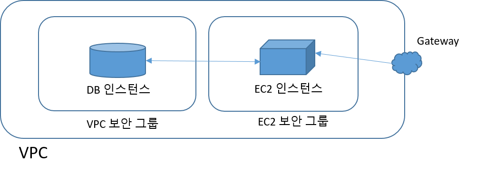

## 1. Amazon RDS 소개

### 1.1 소개 동영상

<iframe width="560" height="315" src="https://www.youtube.com/embed/yjH10T3Miag" frameborder="0" allow="autoplay; encrypted-media" allowfullscreen></iframe>

- 여러분의 애플리케이션과 데이터베이스가 정교하게 튜닝된 기계처럼 함께 동작한다면 훌륭하지 않겠는가?
  - 애플리케이션이 전면에서 고객을 즐겁게 해주고, 데이터베이스는 단지 무대 뒤에서 고객의 데이터를 내구성 있게 저장하고 항상 사용가능하게 해주면서 애플리케이션을 위해 훌륭한 성능을 제공해 준다.
  - 하지만 데이터베이스는 지속적으로 커지게 되며, 더 많은 것을 필요하게 된다.
- 데이터베이스를 운영하는 것은 많은 반복적인 관리 작업을 의미한다. 이것은 반드시 수행해야 하는 작업이지만, 어떻게하면 데이터베이스의 병목현상이 발생하지 않게 미리 앞서 데이터베이스 용량을 증설할지, 어떻게하면 재난에 대비할 수 있을지에 대해 고객에게 직접 도움을 주지는 않는다.
다행스럽게 힘든작업을 피하고 복잡도와 위험을 따라잡을 방법이 있다.
- 아마존 관계형 데이터베이스 서비스, 즉 아마존 RDS는 클라우드 내의 관계형 데이터베이스를 쉽게 설정, 운영, 확장할 수 있는 관리 서비스이다.
  - 여러분은 새로운 아마존 Aurora 엔진, MySQL, PostgreSQL, Oracle 데이터베이스, MS SQL 서버 중에 하나를 고를 수 있다.
  - 더욱이, AWS는 당신을 위해 지속적으로 이들을 패치해 주므로, 당신은 기존 도구와 애플리케이션을 계속해서 사용할수 있다.
- 아마존 RDS는 하드웨어를 구매하여 설치할 필요가 없고, 소프트웨어를 설치할 필요도 없다. 단지, 클릭하여 진행하면, 여러분이 더 중요한 일을 하는 동안 새로운 데이터베이스가 사용가능하게 될 것이다.
- 용량 계획에 스트레스를 받을 필요도 없다.
  - 필요할 때 언제든지 더 많은 용량과 고성능을 얻을 수 있으므로, 데이터베이스를 확장하는 것은 매우 쉽다.
  - 또한 읽기전용 복제본을 추가함으로써, 데이터베이스를 수평적으로 확장(Scale out)할 수도 있다.
- 데이터베이스의 높은 가용성을 부여하는 것도 매우 간단하다. 단지, 다중의 가용영역에서 실행하도록 선택하면 된다.
  - 재난이 발생하면, RDS 는 예비 서버로 전환한다.
  - 버튼을 한번 누르기만 하면, 여러분의 데이터를 가까운 혹은 먼 다른 가용영역으로 복제할 수 있다.
- 데이터베이스를 백업하고 복원하는 작업은 머리아픈일이다.
  - 아마존 RDS는 이를 쉽게 해준다. 당신이 선택한 시점으로 복구하도록 해주는 자동화된 백업을 갖게 된다.
- 또한, 필요시에 일관성 있고 내구성 있는 스냅샷을 갖고 원하는 기간동안 유지하는 쉬운 방법을 갖게 된다.
- 아마존 RDS는 실험하는 것을 쉽고 싸게 해준다.
  - 데이터베이스를 원하는 만큼 복제하고, 실험이 끝났을 때, 실험을 버리면 된다.
  - 당신이 사용한 리소스만 비용을 지불하면 된다.
- 아마존 RDS는 클라우드 내의 관계형 데이터베이스를 쉽게 설정, 운영, 확장할 수 있는 쉬운 방법이다.

---
### 1.2 Amazon RDS (Relational Database Service) 란?
- 클라우드에서 관계형 데이터베이스를 더욱 쉽게 설치, 운영 및 확장할 수 있는 웹 서비스

- **장점**
  - **관리용이성**
    	- HW, SW 설치 없이 관리 콘솔, 명령줄 인터페이스, API 호출등의 방법으로 데이터베이스 관리
  - **뛰어난 확장성**
    	- 수직적 확장 (데이터베이스의 CPU 및 스토리지 확장)
    	- 수평적 확장 (읽기 전용 복제본)
  - **가용성 및 내구성**
    	- 자동화 백업, 데이터베이스 스냅샷, 자동 호스팅 대체 등을 통해 가용성 및 내구성 향상
  - **빠른 속도**
    	- 온라인 트랜잭션 프로세싱 (OLTP)에 최적화된 스토리지 옵션 제공
  - **보안**
    	- 가상 네트워크 환경 (VPC)을 통해 데이터베이스 인스턴스를 외부와 격리하여 DB 인스턴스에 대한 네트워크 액세스 제어
  - **저렴한 비용**
    	- 사전 약정이 필요 없으며, 시작한 데이터베이스 인스턴스별로 월간 요금만 지불
    	- 예약 인스턴스를 통해 보다 저렴한 요금제 사용

---
### 1.3 Amazon RDS 구성요소
- [DB 인스턴스](#1.3.1)
- [지역 및 가용영역](#1.3.2)
- [보안그룹](#1.3.3)
- [DB 파라미터 그룹](#1.3.4)
- [DB 옵션 그룹](#1.3.5)

#### 1.3.1 DB 인스턴스
- **Amazon RDS의 기본 구성요소**로서, 클라우드에 있는 격리된 데이터베이스 환경
  - 사용자가 만든 여러 데이터베이스 포함
  - 기존 도구 및 애플리케이션 (예, 표준 SQL 클라이언트 애플리케이션)을 통해 DB 인스턴스에 접근 가능
- AWS 명령행 인터페이스 (CLI), Amazon RDS API, AWS Management Console을 사용해 DB 인스턴스를 만들고 수정할 수 있음.
- DB 엔진 실행 (MySQL, MariaDB, PostgreSQL, Oracle, MS SQL Server 엔진 지원)
- DB 인스턴스 클래스
  - DB 인스턴스의 CPU 및 메모리 용량 결정
- DB 인스턴스의 스토리지
  - 5GB에서 6TB까지 용량 선택 가능
  - 마그네틱, 범용(SSD) 및 프로비저닝된 IOPS(SSD) 등 세 가지 유형
- Amazon의 Virtual Private Cloud(VPC) 서비스를 사용해 가상 사설 클라우드에서 DB 인스턴스를 실행 가능

#### 1.3.2 지역 및 가용영역
- Amazon 클라우드 컴퓨팅 리소스는 전 세계 여러 지역의 가용성이 높은 데이터 센터 시설에 하우징됨
- 지역마다 가용 영역 또는 AZ라는 고유한 위치가 여러 개 포함됨
  - 각 가용 영역은 다른 가용 영역의 오류로부터 격리
  - 같은 지역의 다른 가용 영역에 경제적이고 지연 시간이 낮은 네트워크 연결을 제공
- 별도의 가용 영역에서 인스턴스를 시작함으로써 단일 위치에서 장애가 발생할 경우 애플리케이션을 보호
- 여러 가용 영역에서 DB 인스턴스를 실행
  - 다중 AZ 배포 옵션
    - Amazon이 다른 가용 영역에서 DB 인스턴스의 동기식 예비 복제본을 자동으로 프로비저닝하고 유지
    - 기본 DB 인스턴스는 가용 영역에서 예비 복제본으로 동기식으로 복제되어 데이터 이중화, 장애 조치 지원을 제공하고 I/O 중지를 제거하고 시스템 백업 중에 지연 시간 스파이크를 최소화

#### 1.3.3 보안
- DB 인스턴스에 대한 액세스를 제어
  - 사용자가 지정한 IP 주소 범위 또는 Amazon EC2 인스턴스에서 액세스할 수 있도록 허용하는 방법으로 제어

- Amazon RDS는 **DB 보안 그룹**, **VPC 보안 그룹** 및 **EC2 보안 그룹**을 사용
  - **DB 보안 그룹**은 VPC 외부의 DB 인스턴스에 대한 액세스를 제어하고,
  - **VPC 보안 그룹**은 VPC 내부의 DB 인스턴스에 대한 액세스를 제어하고,
  - **EC2 보안 그룹**은 EC2 인스턴스에 대한 액세스를 제어하며, DB 인스턴스와 함께 사용

  

#### 1.3.4 DB 파라미터 그룹/ DB 옵션 그룹
- **DB 파라미터 그룹**
  - DB 파라미터 그룹을 사용해 DB 엔진의 구성을 관리
  - 인스턴스 유형이 같은 하나 이상의 DB 인스턴스에 적용할 수 있는 엔진 구성 값을 포함
  - DB 인스턴스를 만들 때 DB 파라미터 그룹을 지정하지 않으면 Amazon RDS가 기본 DB 파라미터 그룹을 적용
    - 기본 그룹에는 특정 데이터베이스 엔진 및 DB 인스턴스의 인스턴스 클래스에 대한 기본값이 포함

- **DB 옵션 그룹**
  - 일부 DB 엔진은 데이터베이스를 간편하게 관리하고 데이터를 적극 활용할 수 있는 추가 기능을 제공
  - Amazon RDS는 DB 옵션 그룹을 사용하여 이러한 기능을 활성화 하고 구성

#### 1.3.5 사용 가능한 RDS 인터페이스
- Amazon RDS 콘솔
  - 웹 기반 사용자 인터페이스 (https://console.aws.amazon.com/rds/)
- 명령행 인터페이스
  - Amazon RDS API에서 사용할 수 있는 기능의 대다수에 액세스할 수 있는 권한을 제공하는 명령줄 인터페이스
- 애플리케이션 프로그래밍 인터페이스 (API)
  - Query API
  - SOAP API
  - 라이브러리
	    - 언어별로 고유한 API를 사용하여 애플리케이션을 빌드하는 것을 선호하는 소프트웨어 개발자를 위해 라이브러리, 샘플 코드, 자습서 및 기타 리소스를 제공
	    - Java
	    - PHP
	    - Python
	    - Ruby
	    - Windows 및 .NET
