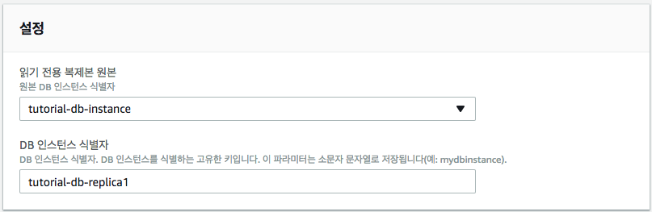

## 5. 확장

### 5.1 Vertical Scaling (Scale Up)
- Vertical Scaling (Scale Up)은 CPU, Memory 등 HW적인 사양을 높임으로써 시스템이 더 많은 요청을 더 빨리 수행할 수 있도록 확장하는 방안
- **RDS Scale Up 절차**
	1. AWS Management Console에 로그인한 다음 https://console.aws.amazon.com/rds/ 에서 Amazon RDS 콘솔을 엽니다
	2. 탐색 창에서 [**인스턴스**]를 선택
	3. DB 인스턴스를 선택하고, [**인스턴스 작업**]-[**수정**] 선택하여 **인스턴스 사양**의 필요한 설정 변경후에 **계속** 클릭
	
		
	
	4. 즉시 설정변경을 적용하고자 하는 경우에는 [**즉시 적용**] 체크 후, [**DB 인스턴스 수정**] 클릭
		- **Multi-AZ Deployment가 Yes인 상태에서 Scale Up 하는 경우에는 다운타임없이, DB 인스턴스가 변경이 이루어짐**

### 5.2 Horizontal Scaling (Scale Out)
- 데이터베이스 읽기 전용 복제본을 사용하여 데이터베이스를 확장하는 방안
- 원본 DB 인스턴스에 적용된 변경사항은 읽기 전용 복제본 (Read Replica)에도 동시에 적용
- 애플리케이션에서 읽기 전용 복제본으로 읽기 쿼리를 라우팅하여 원본 DB 인스턴스의 로드에 대한 부하를 줄임

	
	- 출처: https://aws.amazon.com/ko/blogs/aws/amazon-rds-announcing-read-replicas/

### 5.3 읽기 전용 복제본 만들기
- 절차
	1. 기존 DB 인스턴스를 원본으로 지정
	2. Amazon RDS가 원본 인스턴스의 스냅샷을 캡처한 후 이 스냅샷을 이용해 읽기 전용 인스턴스를 생성
	3. 원본 DB 인스턴스를 변경할 때마다 Amazon RDS가 DB 엔진에 **비동기식 복제 방법을 사용하여 읽기 전용 복제본을 업데이트**

- Amazon RDS가 원본 DB 인스턴스의 DB 스냅샷을 캡처하는 동안 원본 인스턴스에 짧게 I/O 지연이 발생
	- 원본 DB 인스턴스가 다중 AZ 배포(다중 AZ 배포의 경우 DB 스냅샷이 예비 인스턴스에 생성됨)인 경우에는 발생하지 않음.
- 읽기 전용 복제본이 DB 인스턴스의 역할을 하지만 **읽기 전용 연결만 가능**
- 애플리케이션을 읽기 전용 복제본에 연결하는 방법은 DB 인스턴스에 하는 것과 동일
- Amazon RDS는 **원본 DB 인스턴스의 데이터베이스를 모두 복제**
- Amazon RDS는 **원본 DB 인스턴스와 읽기 전용 복제본 사이에 안전한 통신 채널을 설정**
	- MySQL DB 인스턴스는 원본 DB 인스턴스와 읽기 전용 복제본 사이에 퍼블릭 키 암호화를 사용

#### 5.3.1 읽기 전용 복제본 만들는 방법
1. AWS Management Console에 로그인한다음 https://console.aws.amazon.com/rds/ 에서 Amazon RDS 콘솔을 엽니다.
2. 탐색 창에서 **인스턴스**를 클릭합니다.
3. DB 인스턴스를 선택하고, [**인스턴스 작업**]-[**읽기 전용 복제본 생성**] 선택합니다.
4. **설정**의 [**DB 인스턴스 식별자**] 텍스트 상자에 읽기 전용 복제본의 이름(예, *tutorial-db-replica1*)을 입력합니다. 필요에 따라 다른 설정을 조정합니다.
	
	
	
5. 원본 DB 인스턴스의 리전과 다른 곳인 경우에는 **네트워크 및 보안**의 [**대상 리전**] 상자에 읽기 전용 복제본의 리전을 지정합니다.
6. 읽기 전용 복제본을 VPC에 생성하고 싶은 경우에는 **네트워크 및 보안**의 [**대상 DB 서브넷 그룹**] 상자에 해당 VPC와 연동되어 있는 DB 서브넷 그룹을 지정합니다. 
	 - 반대로 읽기 전용 복제본을 VPC 외부에 생성하고 싶을 때는 해당 상자에서 **없음**을 선택합니다. 
	 - VPC와 DB 서브넷 그룹은 대상 리전에 존재해야 합니다. 임의의 한 리전 내에서 동일한 원본 DB 인스턴스를 통해 생성된 읽기 전용 복제본은 다음 중 한 가지가 되어야 합니다.
		- 모두 동일한 VPC에서 생성되어야 합니다.
		- 모두 VPC 외부에서 생성되어야 합니다.
7. 필요한 설정을 마친 후에, [**읽기 전용 복제본 생성**]을 클릭합니다.

	

<!--	
### 5.4 읽기 전용 복제본의 DB 인스턴스 승격
- MySQL, MariaDB 또는 PostgreSQL 읽기 전용 복제본을 독립 실행형 DB 인스턴스로 승격할 수 있습니다.
- 읽기 전용 복제본을 **독립 실행형 DB 인스턴스로 승격해야 하는 경우**
	- **DDL 작업 실행(MySQL 및 MariaDB에 한함)**
		- 인덱스를 생성하거나 리빌드하는 등의 DDL 작업은 시간이 걸릴 뿐만 아니라 DB 인스턴스에 상당한 성능 저하를 초래
		- DDL 작업을 MySQL 읽기 전용 복제본에서 수행할 수 있음. 단 읽기 전용 복제본이 원본 DB 인스턴스와 동기화되어 있어야 함
		- 그런 다음 읽기 전용 복제본을 승격해야 애플리케이션이 승격된 인스턴스를 사용하도록 유도할 수 있음.
	- **샤딩 (Sharding)**
		- 샤딩은 데이터베이스를 다수의 소규모 데이터베이스로 분할하는 기술
		- 분할된 각 "샤드"(소규모 데이터베이스)마다 읽기 전용 복제본을 생성한 후 "독립된" 샤드로 전환하면서 승격
	- **원본 DB 인스턴스에 장애가 발생할 경우 읽기 전용 복제본 승격을 데이터 복구 방법으로 사용할 수 있음.** 
		- 하지만, 동기식 복제, 자동 장애 감지 및 장애 조치가 필요한 경우에는 DB 인스턴스를 다중 AZ 배포로 운영하는 것이 바람직함
	- 비동기식 복제의 영향이나 한계에 대해 알고 있으면서도 데이터 복구를 위해 읽기 전용 복제본을 사용하려면 
		1. 읽기 전용 복제본을 생성한 다음 원본 DB 인스턴스의 장애 여부를 모니터링
		2. 장애 발견시, 읽기 전용 복제본을 승격
		3. 데이터베이스 트래픽을 승격된 DB 인스턴스로 유도
		4. 승격된 DB 인스턴스를 원본으로 하는 교체용 읽기 전용 복제본을 생성

		

- 승격 프로세스는 읽기 전용 복제본의 크기에 따라 완료하는 데 몇 분이 걸림
- 읽기 전용 복제본이 단일 AZ DB 인스턴스로 승격되면 다른 단일 AZ DB 인스턴스와 다를 것이 없음
	- 새롭게 승격된 DB 인스턴스를 다중 AZ DB 인스턴스로 전환 가능
	- 새롭게 승격된 DB 인스턴스의 읽기 전용 복제본을 생성 가능
	- DB 스냅샷을 캡처하여 특정 시점으로 복구 작업을 실행할 수도 있음
- 읽기 전용 복제본이 승격되면, 더이상 기존 원보 DB 인스턴스의 복제를 수행하지 않음
- 원본 DB 인스턴스에 읽기 전용 복제본이 다수 있을 경우 읽기 전용 복제본 하나를 DB 인스턴스로 승격하더라도 나머지 복제본에는 아무런 영향도 끼치지 않음

#### 5.4.1 읽기 전용 복제본의 DB 인스턴스 승격 방법
1. AWS Management Console에 로그인한 다음 https://console.aws.amazon.com/rds/ 에서 Amazon RDS 콘솔을 엽니다.
2. Amazon RDS 콘솔에서 [**Instances**]를 클릭합니다.
3. [**Instances**] 창에서 승격할 읽기 전용 복제본 를 마우스 오른쪽 버튼으로 클릭한 후 [**Promote Read Replica**]를 클릭합니다.
4. [**Promote Read Replica**] 대화 상자에 새롭게 승격된 DB 인스턴스의 백업 보존 기간과 백업 기간을 입력합니다.
5. 원하는 대로 설정되었으면 **Continue**를 클릭합니다.
6. 승인 페이지에서 [**Yes, Promote**]를 클릭합니다.

-->

### 5.4 실습 - 읽기 전용 복제본 사용
- 사전 준비
	- 실습: MariaDB DB 인스턴스 생성 및 웹서버 생성 완료
	- RDS 읽기 전용 복제본 준비 (tutorial-db-replica1)

- /var/www/inc/dbinfo.inc 편집

	```
	<?php 
	define('DB_SERVER', ‘db_servier_endpoint'); 
   define('DB_REPLICA', ‘db_replica_endpoint'); 
	define('DB_USERNAME', 'tutorial_user');
	define('DB_PASSWORD', 'master_password'); 
	define('DB_DATABASE', 'sample'); 
?>
	```
	- *db\_server\_endpoint* 와 *db\_replica\_endpoint*는 생성된 DB 인스턴스 원본과 읽기전용 복제본의 엔드포인트(포트 없음)로 대체

- 다음 링크의 콘덴츠를 /var/www/html/SamplePage2.php 에 저장
	https://github.com/kwanulee/AWSExample/blob/master/RDS-PHP/SamplePage2.php
	
- 웹 서버를 열고 http://EC2 instance endpoint/SamplePage2.php (예: http://ec2-52-79-51-167.ap-northeast-2.compute.amazonaws.com/SamplePage2.php) 를 검색하여 웹 서버에서 RDS MariaDB DB 인스턴스에 제대로 연결되는지 확인
