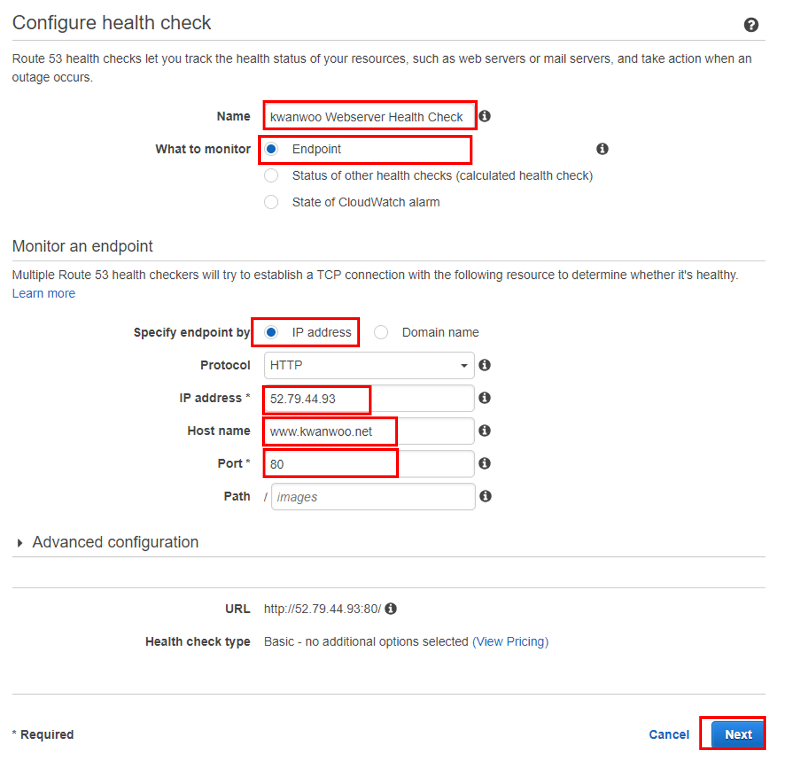
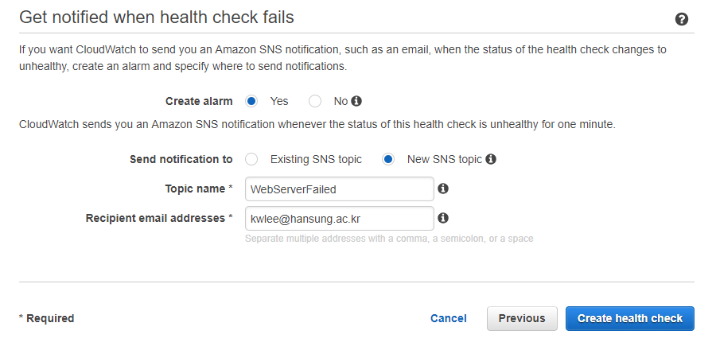
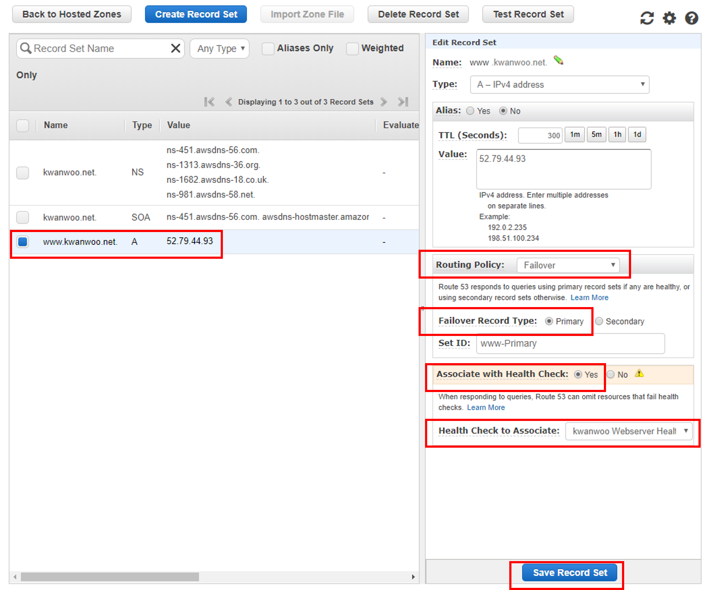

<style>
div.polaroid {
  	width: 400px;
  	box-shadow: 0 10px 30px 0 rgba(0, 0, 0, 0.2), 0 16px 30px 0 rgba(0, 0, 0, 0.19);
  	text-align: center;
	margin-bottom: 0.5cm;
}
</style>

# Amazon Route53
- [Amazon Route53 소개](#1)
- [Amazon Route53 시작하기](#2)

---
<a name="1"> </a>
## 1. Amazon Route53 소개

<iframe width="560" height="315" src="https://www.youtube.com/embed/VBW-5mwDKXQ" frameborder="0" allow="autoplay; encrypted-media" allowfullscreen></iframe>

https://www.youtube.com/watch?v=VBW-5mwDKXQ

### 1.1 Amazon Route53 와 DNS (Domain Name System)
- **Amazon Route 53**
    - 가용성과 확장성이 뛰어난 DNS(도메인 이름 시스템) 웹 서비스
- **DNS (Domain Name System)**
    - example.com 같이 쉽게 이해할 수 있는 도메인 이름을 컴퓨터가 인터넷에서 서로를 찾을 수 있도록 해 주는 IP 주소라는 숫자로 변환하는 시스템

		<div class="polaroid">
  		
  		</div>

- Amazon Route 53의 주요 기능
  - 도메인 이름 등록
  - 인터넷 트래픽을 도메인의 리소스로 라우팅
  - 리소스 상태 확인

### 1.2 도메인 이름 등록
- 도메인 이름이란?
    - 사용자가 웹 사이트 또는 웹 애플리케이션에 액세스하기 위해 웹 브라우저의 주소 표시줄에 입력하는 *example.com*과 같은 이름
- 도메인 이름 등록 절차
    1. 원하는 **도메인 이름**이 사용가능한지 확인
    2. **Amazon Route 53**을 이용해 도메인 이름을 등록
      - 도메인을 등록할 때는 도메인 소유자 및 다른 연락처의 이름과 연락처 정보를 제공
    3. AWS는 **도메인 등록 대행자**에게 사용자의 정보를 전송
    4. **도메인 등록 대행자**는 사용자 정보를 도메인의 **등록 기관**으로 전송
        - **도메인 등록 대행자**
            - 특정 최상위 도메인 (Top Level Domain) 등록을 처리하는 회사
            - *Amazon Registrar, Inc.*는 .com, .net, .org 도메인의 등록 대행자
    5. **등록 기관**은 자체 데이터베이스에 사용자의 도메인에 관한 정보를 저장하고 일부 정보는 퍼블릭 WHOIS 데이터베이스에도 저장
        - **도메인 등록 기관**
            - 특정 최상위 도메인을 가진 도메인을 판매할 권리를 소유한 회사
            - *VeriSign*은 .com TLD를 가진 도메인을 판매할 권리를 소유한 등록 기관

### 1.3 인터넷 트래픽을 도메인의 리소스로 라우팅


- 절차
  1. 사용자들이 웹 사이트 또는 웹 애플리케이션에 액세스하는 데 사용될 도메인 이름을 등록해야 합니다.
  2. 도메인 이름을 등록한 후 Amazon Route 53은 도메인과 동일한 이름의 **퍼블릭 호스팅 영역**을 자동으로 생성합니다.
  3. 트래픽을 리소스로 라우팅하려면 호스팅 영역에 **레코드**라고도 하는 **리소스 레코드 세트**를 생성해야 합니다.
      - 각각의 레코드에는 도메인의 트래픽을 라우팅할 방법에 관한 다음과 같은 정보가 포함되어 있습니다.

	    	- **이름** : 트래픽을 라우팅할 도메인 이름(예: example.com) 또는 하위 도메인 이름(예: www.example.com)|
	    	- **Type** : 트래픽을 라우팅할 리소스 유형 (예, IPv4 IP 주소를 가진 웹 서버로 트래픽을 라우팅하려면 [Type]을 [A]로 설정)
	    	- **값** : [Value]는 [Type]과 관련 (예, [Type]을 [A]로 지정하는 경우, 192.0.2.136과 같은 IPv4 형식의 IP 주소를 지정)

### 1.4 리소스 상태 확인
- Amazon Route 53 상태 확인은 웹 서버 및 이메일 서버 같은 리소스의 상태를 모니터링합니다.
- 필요할 경우, 상태 확인이 가능하도록 Amazon CloudWatch 경보를 구성하여 리소스를 사용할 수 없게 될 때 알림을 수신할 수 있습니다.
- 리소스를 사용할 수 없게 될 때 알림을 수신하고자 하는 경우, 상태 확인이 작동하는 방식의 개요

  

1. 상태 확인을 생성하고 원하는 상태 확인 작동 방식을 정의하는 값을 지정
    - 모니터링하려는 웹 서버 등 엔드포인트의 IP 주소나 도메인 이름
    - 상태 확인에 사용할 프로토콜
    - 요청 간격: 엔드포인트에 요청을 전송하는 주기
    - 엔드포인트의 요청 응답 연속 실패 횟수
2. Amazon Route 53은 사용자가 상태 확인에서 지정한 시간 간격으로 엔드포인트에 요청을 전송
3. 엔드포인트가 요청에 응답하지 않으면 Amazon Route 53은 엔드포인트가 응답하지 않는 연속적 요청 횟수를 세기 시작
4. Amazon Route 53이 엔드포인트가 비정상이라고 판단하고 사용자가 상태 확인 알림을 구성한 경우, Amazon Route 53은 CloudWatch에 알림
5. 상태 확인 알림을 구성한 경우, CloudWatch는 경보를 트리거하고 Amazon SNS를 사용하여 지정된 수신자에게 알림을 전송
    - CloudWatch는 사용자에게 직접 연락하지 않습니다


## 2. Amazon Route 53 시작하기
- 사전준비
  - Elastic IP가 할당된 EC2 인스턴스에 웹 사이트 호스팅
- 1단계: 도메인 등록
- 2단계: 도메인의 트래픽을 EC2 웹 사이트로 라우팅
- 3단계: EC2 웹 사이트로의 Route53 헬스 체크를 추가
- 4단계: DNS 장애시 Amazon S3 정적 웹사이트로 라우팅하도록 설정

### 2.1 1단계: 도메인 등록
- **도메인 이름을 등록하면 일반적으로 1년 동안 도메인 이름을 독점적으로 사용할 수 있지만, 비용이 지불됩니다.**
1. AWS Management Console에 로그인한 다음  https://console.aws.amazon.com/route53/ 에서 Amazon Route 53 콘솔을 엽니다.
2. Amazon Route 53을 처음 사용하는 경우 [**Domain registration**] 아래에서 [**Get Started Now**]를 선택합니다.
  - 탐색 창에서 Amazon Route 53을 이미 사용 중인 경우 [**Registered Domains**]를 선택합니다.
3. [**Register Domain**]을 선택합니다.
4. 등록하고자 하는 도메인 이름을 입력하고, [**Check**]를 선택하여 그 도메인 이름이 사용 가능한지 알아봅니다.
5. 도메인이 사용 가능하다면 [**Add to cart**]를 선택합니다. 장바구니에 도메인 이름이 표시됩니다.
6. 장바구니에서 도메인을 등록할 연 수를 선택합니다.
7. [**Continue**]를 선택
8. 입력한 정보를 검토하고, 서비스 계약 조건을 읽은 다음, 확인란을 선택하여 서비스 계약 조건을 읽었음을 확인합니다.
9. [**Complete Purchase**]를 선택합니다.

### 2.2 2단계:도메인의 트래픽을 EC2 웹 사이트로 라우팅
1. https://console.aws.amazon.com/route53/ 에서 Amazon Route 53 콘솔을 엽니다.
2. 탐색 창에서 [**Hosted zones**]를 선택합니다.
    - 도메인을 등록할 때 Amazon Route 53이 같은 이름의 호스팅 영역을 자동으로 생성합니다.
3. 호스팅 영역 목록에서 도메인의 이름을 선택합니다.
    
4. [**Create Record Set**]를 선택합니다.
  - 각각의 리소스 레코드 세트에는 하나의 도메인(예: kwanwoo.net) 또는 그 하위 도메인(예: www.kwanwoo.net)에 트래픽을 라우팅하려는 방법에 관한 정보가 포함되어 있습니다.
  - 다음 값을 지정한 후에 [**Create**]  클릭
    - [**Name**] : www
    - [**Type**] : A-IPv4 address
    - [**Alias**]: No
    - [**Value**]: EC2 웹 사이트의 Elastic IP 값
    - [**Routing Policy**]: Simple

    

6. 생성결과
    

7. 테스트
    - IP (예, 52.79.44.93)로 접속

      

    - Domain Name으로 접속

      


### 2.3 3단계: EC2 웹 사이트로의 Route53 헬스 체크를 추가
1. https://console.aws.amazon.com/route53/ 에서 Amazon Route 53 콘솔을 엽니다.
2. 탐색 창에서 [**Health Checks**]를 선택합니다.
3. 상태 확인을 생성하고 싶다면, [**Create Health Check**]를 선택합니다.
4. 관련 값들을 입력한 후, [**Next**] 선택합니다.

    

5. [**Create alarm**]에 대해서 [*Yes*] 선택
6. [**Send notification to**]에 대해서 [*New SNS topic*] 선택
7. [**Topic name**]에 대해서 [*WebServerFailed*] 입력
8. [**Recipient email addresses**]에 대해서, 이메일 주소 입력
9. [**Create health check**] 선택

  

### 2.4 4단계: DNS 장애시 Amazon S3 정적 웹사이트로 라우팅하도록 설정
1. Primary Failover Record 설정
    - 기존 호스팅 영역의 레코드 세트를 Primary Failover Record로 변경
2. 장애발생 시, 라우팅될 Amazon S3 정적 웹사이트 준비
3. Secondary Failover Record 생성
    - 이전 단계에서 설정된 Amazon S3 정적 웹사이트로의 Secondary Failover Record를 새로이 생성

#### 4-1단계: Primary Failover Record 설정
1. https://console.aws.amazon.com/route53/ 에서 Amazon Route 53 콘솔을 엽니다.
2. 탐색 창에서 [**Hosted zones**]를 선택합니다.
3. 호스팅 영역 목록에서 *도메인의 이름*을 선택합니다.
4. [**Type**]열의 값이 [*A*]인 레코드를 선택
5. [**Routing Policy**]에서 [*Failover*] 선택
6. [**Failover Record Type**]에서 [*Primary*] 선택
7. [**Associate with Health Check**]에서 [*yes*] 선택
8. [**Health Check to Associate**] 드롭다운 리스트에서 하나 선택.
9. [**Save Record Set**] 선택

  

#### 4-2단계: 장애발생 시, 라우팅될 Amazon S3 정적 웹사이트 준비
1. https://console.aws.amazon.com/s3/ 에서 Amazon S3 콘솔을 엽니다.
2. S3 콘솔 우측 상단 모서리에 [Switch to the old console] 버튼이 표시되면 선택합니다.
3. [**버킷 만들기**]을 클릭합니다.
4. [**버킷 이름**]에 *www.kwanwoo.net* 같은 도메인 이름을 입력합니다.
5. [**지역**]에서 대부분의 사용자와 가장 가까운 리전을 선택합니다.
6. [**다음**]을 계속 누르고, [**버킷 만들기**]가 나오면 이를 쿨릭

  

7. 버킷 이름을 선택하고, [**권한**] 탭을 선택
8. [**버킷정책**]을 선택하고, 다음 버킷 정책을 복사하여 텍스트 편집기에 붙여 넣습니다.

  ```
  { 	
	"Version":"2012-10-17",
	"Statement":[{
		"Sid":"AddPerm",
		"Effect":"Allow",
		"Principal":"*",
		"Action":[ "s3:GetObject" ],
		"Resource":[
			"arn:aws:s3:::your-domain-name/*"
		]
	}]
}
  ```
9. 버킷 정책에서 값 [**your-domain-name**]을  www.kwanwoo.net  같은 도메인 이름으로 대체합니다.

10. [**속성**] 탭에서  [**정적 웹 사이트 호스팅**]을 확장합니다.
11. [**이 버킷을 사용하여 웹 사이트를 호스팅합니다**]을 선택합니다.
12. [**인덱스 문서**]에 index.html을 입력합니다.
  - 이것은 이 프로세스 뒷부분에서 만들 HTML 파일에 붙일 이름입니다.
13. [**저장**]를 선택합니다.
14. 버킷(예, www.kwanwoo.net)에 index.html 파일을 업로드 합니다.
    - **Index.html은 미리 준비되어 있어야 합니다.**

#### 4-3단계:Secondary Failover Record 생성
1. https://console.aws.amazon.com/route53/ 에서 Amazon Route 53 콘솔을 엽니다.
2. 탐색 창에서 [**Hosted zones**]를 선택합니다.
3. 호스팅 영역 목록에서 도메인의 이름을 선택합니다.
4. [**Create Record Set**]을 선택합니다.
5. [**Name**] 박스에서 [*www*] 입력
6. [**Type**] 드롭다운 리스트에서 [*A – IPv4 address*] 선택합니다.
7. [**Alias**]에서 [*Yes*]를 선택합니다.
8. [**Alias Target**] 드롭다운 리스트에서 [**S3 Website Endpoints**]의 endpoint를 선택

    

9. [**Routing Policy**] 에서 [*Failover*] 선택
10. [**Failover Record Type**]에서 [*Secondary*] 선택
11. [**Associate with Health Check**]에서 [*No*] 선택
12. [**Create**] 선택

  

  

#### 헬스 체크와 Failover 테스트
1. EC2 Management Console 에서 Webserver EC2 인스턴스를 중단
2. Route 53 Management Console에서 [**Health Check**] 클릭
3. 이전에 생성한 헬스 체크 선택
4. [**Monitoring**] 탭을 클릭하여 헬스 체크의 그래프 조회
5. 상태가 **Unhealthy**로 변할 때까지 페이지를 refresh
  -  **Unhealthy** 상태가 변할 때까지 약 2분이 소요됨
6. 상태가  **Unhealthy**로 변하면, 브라우저에 도메인 이름을 입력
  - Amazon S3 웹 사이트로 트래픽이 이동된 것을 확인
