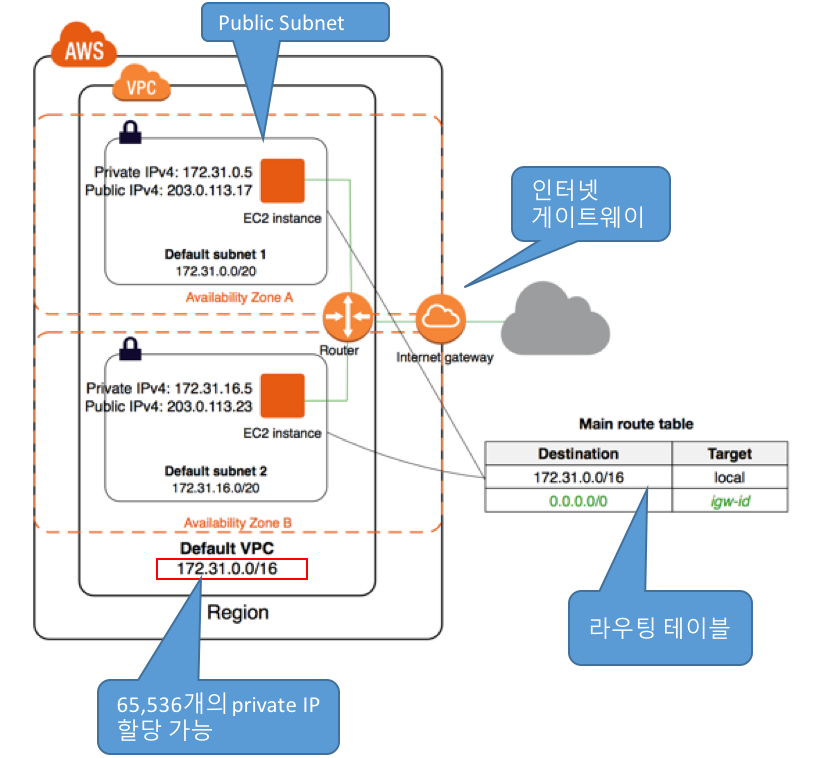
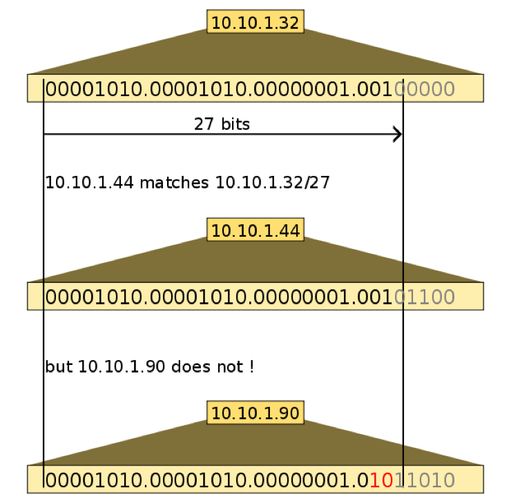
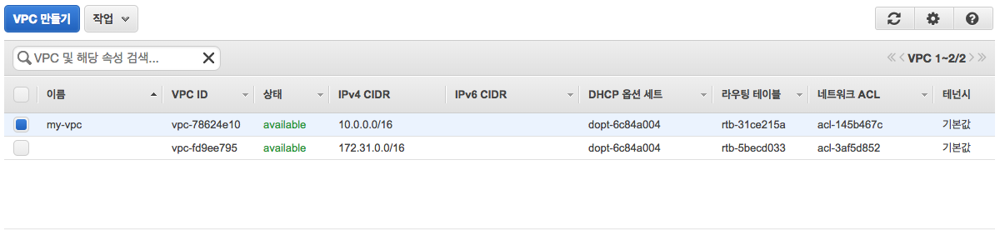
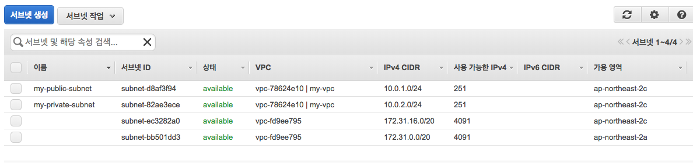
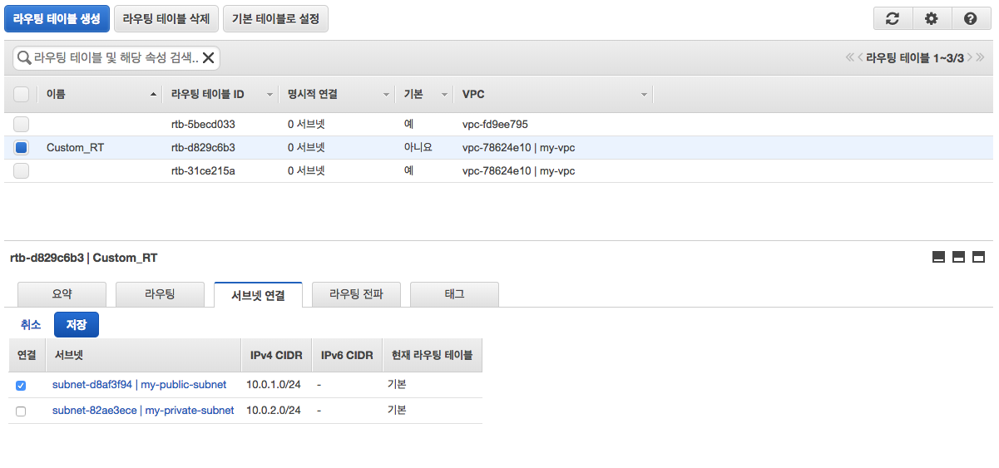
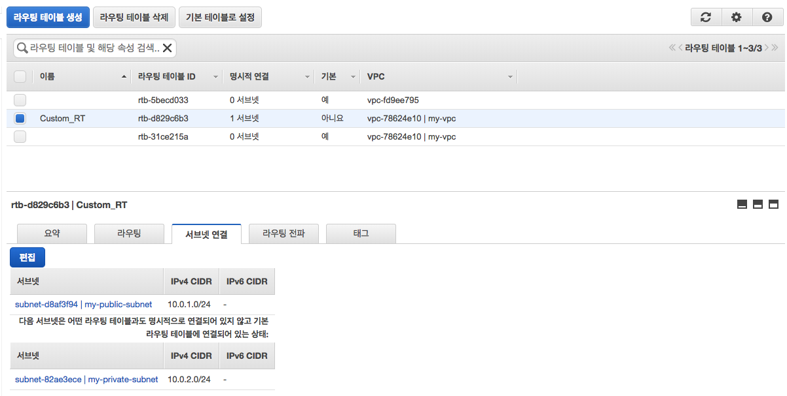
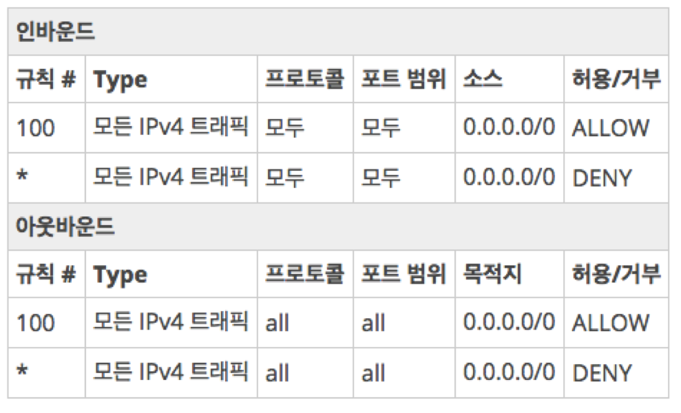

# Amazon VPC
- [Amazon VPC 소개](#1)
- [Amazon VPC 시작하기](#2)
- [Amazon VPC 주요 개념](#3)

---

## 1. Amazon VPC 소개

<iframe width="560" height="315" src="https://www.youtube.com/embed/hMvpnK0gJPc" frameborder="0" allow="autoplay; encrypted-media" allowfullscreen></iframe>

https://youtu.be/hMvpnK0gJPc

### 1.1 VPC (Virtual Private Cloud) 란?
- Amazon Web Services(AWS) 리소스를 시작시킬 수 있는 **정의된 가상 네트워크**
	- 고객의 자체 데이터 센터에서 운영하는 기존 네트워크 매우 유사하나, AWS의 확장 가능한 인프라를 사용한다는 이점이 있음.
	- AWS 클라우드 내의 다른 가상 네트워크와 논리적으로 분리되어 있음
	- **VPC**는 다수의 **서브넷**으로 구성 
		- **Public subnet**: 외부 접속이 가능
		- **Private subnet**: 외부접속이 불가능
	- 서브넷 사이의 통신은 **라우팅 테이블(Route Table)**을 이용
	- 인터넷을 통한 외부접속은 **인터넷 게이트웨이(internet gateway)**로 트래픽을 라우팅
	- 세분화된 접근 제어 가능
	- 기존 데이터센터와의 연결을 통해 AWS를 회사 인프라의 일부처럼 사용

	

		
	

### 1.2 기본 VPC vs. 사용자 VPC
- 기본 VPC
	- 2013년 12월 4일 이후에 AWS 계정을 만든 경우에는 각 AWS 리전마다 기본 VPC 제공
	- 기본 VPC는 바로 사용할 수 있으므로 별도의 구성 단계 없이 즉시 인스턴스를 기본 VPC에서 시작할 수 있음.
- 사용자 정의 VPC
	- 보안이 강화된, 개인화된 가상 네트워크 구성 목적
	- 서브넷 구성, IP 주소 범위 선택, 라우팅 테이블 구성, 네트워크 게이트웨이 및 보안 설정

	
## 2. Amazon VPC 시작하기	

- 다음 [링크](https://docs.aws.amazon.com/ko_kr/AmazonVPC/latest/UserGuide/getting-started-ipv4.html)를 클릭하여 Amazon VPC 생성을 연습합니다.

## 3. Amzaon VPC 주요 개념
- [VPC](#vpc)
- [VPC subnet](#subnet)
- [Internet Gateway](#gateway)
- [Route Table](#route_table)
- [Security Group](#sg)
- [Network ACLs](#acl)

 
### 3.1 VPC
- Virtual Private Cloud(VPC)는 사용자의 AWS 계정 전용 가상 네트워크
- VPC는 AWS 클라우드에서 다른 가상 네트워크와 논리적으로 분리되어 있습니다. 
- Amazon EC2 인스턴스와 같은 AWS 리소스를 VPC에서 실행할 수 있습니다.
- VPC를 만들 때 VPC의 IPv4 주소의 범위를 **CIDR(Classless Inter-Domain Routing)** 블록 형태로 지정해야 합니다(예: 10.0.0.0/16). 

	- [참고] CIDR 블럭
		- **사이더 블록**이라 불리는 그룹에 포함된 여러 IP 주소는 이진 표기를 하였을 때 동일한 일련의 초기 비트를 가진다.
		
		

			
		

		
		
- VPC를 만들면 리전의 모든 가용 영역에 적용됩니다.
	

			
	

	
#### 3.1.1 VPC 만들기 (실습)
- https://docs.aws.amazon.com/ko_kr/AmazonVPC/latest/UserGuide/working-with-vpcs.html#Create-VPC
- 결과
	

 
### 3.2 VPC subnet

- VPC를 만든 후 각 가용 영역에 하나 이상의 서브넷을 추가할 수 있습니다. 
	- 서브넷이란?
		- 서브넷이란 하나의 IP 네트워크 주소를 지역적으로 나누어 이 하나의 네트워크 IP 주소가 실제로 여러개의 서로 연결된 지역 네트워크로 사용할 수 있도록 하는 방법이다

			출처: http://pos7.tistory.com/entry/서브넷이란-SUBNET 
- 서브넷을 만들 때 해당 서브넷에 대한 CIDR 블록을 지정합니다. 
- **각 서브넷은 단일 가용 영역 내에서만 존재**해야 하며, 여러 영역으로 확장할 수 없습니다. 
	- 각 가용 영역은 다른 가용 영역에서 발생한 장애를 격리시킬 수 있도록 서로 분리된 공간입니다. 
	- 별도의 가용 영역에서 인스턴스를 시작함으로써 단일 위치에서 장애가 발생할 경우 애플리케이션을 보호할 수 있습니다. 
	- AWS는 각 서브넷에 고유 ID를 할당합니다. 
- 서브넷 유형
	- **퍼블릭 서브넷 (Public Subnet)**: 서브넷 트래픽이 인터넷 게이트웨이로 라우팅
	- **프라이빗 서브넷 (Private Subnet)**: 인터넷 게이트웨이로 라우팅 되지 않는 서브넷
	- **VPN 전용 서브넷**: 서브넷이 인터넷 게이트웨이에 이르는 경로를 갖고 있지 않지만 그 트래픽이 VPN 연결을 위한 가상 프라이빗 게이트웨이로 라우팅

	
	
#### 3.2.1 VPC에서 서브넷 만들기 (실습)
- https://docs.aws.amazon.com/ko_kr/AmazonVPC/latest/UserGuide/working-with-vpcs.html#AddaSubnet

- 결과
	

### 3.3 	VPC 서브넷의 인스턴스에 대한 인터넷 액세스 활성화
- VPC 서브넷의 인스턴스에 대한 인터넷 액세스를 활성화하려면,
**VPC에 인터넷 게이트웨이를 연결**합니다.
	- **서브넷의 라우팅 테이블이 인터넷 게이트웨이를 가리키는지 확인**합니다.
	- 서브넷의 인스턴스에 **전역적으로 고유한 IP 주소(퍼블릭 IPv4 주소, 탄력적 IP 주소 또는 IPv6 주소)가 있는지 확인**합니다.
	- 네트워크 액세스 제어 및 보안 그룹 규칙에서 적절한 **트래픽이 인스턴스로, 그리고 인스턴스에서 흐르도록 허용되는지 확인**합니다.

	

 	
#### 3.3.1 인터넷 게이트웨이
- **인터넷 게이트웨이**는 수평 확장되고 가용성이 높은 중복 VPC 구성 요소로, **VPC의 인스턴스와 인터넷 간에 통신할 수 있게 해줍니다.** 
- **VPC당 하나의 인터넷 게이트웨어 설정**
- **인터넷 게이트웨이 생성 및 연결 (실습)**
	- https://docs.aws.amazon.com/ko_kr/AmazonVPC/latest/UserGuide/VPC_Internet_Gateway.html#Add_IGW_Attach_Gateway 

	- 결과
		
		
 
#### 3.3.2 라우팅 테이블
- **라우팅 테이블**에는 **네트워크 트래픽을 전달할 위치를 결정하는 데 사용되는 라우팅이라는 규칙 집합이 포함**됨.
- **VPC의 각 서브넷을 라우팅 테이블에 연결**해야 합니다. 
	- 테이블에서는 서브넷에 대한 라우팅을 제어합니다. 
	- 서브넷을 한 번에 하나의 라우팅 테이블에만 연결할 수 있지만, 여러 서브넷을 동일한 라우팅 테이블에 연결할 수 있습니다.

	

##### 3.3.2.1 기본/사용자지정 라우팅 테이블
- **VPC를 생성하면 수정할 수 있는 기본 라우팅 테이블이 함께 자동으로 제공**됩니다.
- VPC에 **사용자 지정 라우팅 테이블을 추가로 만들 수 있습니다.**

	- Amazon VPC 콘솔의 [**라우팅 테이블**] 페이지의 [**기본(Main)**] 열에서 [**예**]를 찾아 VPC에 대한 기본 라우팅 테이블을 확인할 수 있음

##### 3.3.2.2 라우팅 테이블 연결
- **서브넷에 대한 라우팅을 제어하는 라우팅 테이블에 각 서브넷을 암시적 또는 명시적 연결**해야 합니다. 
	
	- 서브넷을 특정 라우팅 테이블에 명시적으로 연결하지 않을 경우 서브넷은 기본 라우팅 테이블에 **암시적으로 연결**됩니다.
	- VPC 콘솔은 각 라우팅 테이블에 명시적으로 연결된 서브넷의 수를 보여준다.
		- 자세한 내용은 [테이블과 명시적으로 연결되어 있는 서브넷 확인](https://docs.aws.amazon.com/ko_kr/AmazonVPC/latest/UserGuide/VPC_Route_Tables.html#Route_Which_Associations) 참조

- **기본 라우팅 테이블은 삭제할 수 없지만, 기본 라우팅 테이블을 사용자가 만든 사용자 지정 테이블로 바꿀 수 있습니다.**

- **VPC를 보호하는 한 가지 방법** 
	- 기본 라우팅 테이블을 (로컬 경로만 있는) 원래의 기본 상태로 두고, 사용자가 새로 생성하는 각 서브넷을 자신이 생성한 사용자 지정 라우팅 테이블 중 하나와 명시적으로 연결하는 것
		- 새 서브넷을 생성하면 서브넷이 트래픽을 가상 프라이빗 게이트웨이로 라우팅하는 기본 라우팅 테이블과 자동으로 연결
		- 반대로 구성을 설정하면 새 서브넷은 인터넷 게이트웨에 대한 라우팅을 갖게됨

##### 3.3.2.3 사용자 지정 라우팅 테이블 생성 (실습)
1. https://console.aws.amazon.com/vpc/ 에서 Amazon 	VPC 콘솔을 엽니다. 
2. 탐색 창에서 [**라우팅 테이블**]를 선택합니다. 
3. [**라우팅 테이블 생성**]을 선택합니다. 
4. [**라우팅 테이블 생성**] 대화 상자에서 [Name tag]에 라우	팅 테이블 이름을 선택적으로 지정할 수 있습니다. 
	- 이름을 지정하면 Name 키와 사용자가 지정하는 값을 가진 태그가 생성됩니다. 
	- [**VPC**]에 대해 VPC를 선택한 후 [**예, 생성**]를 선택합니다. 
	
 
##### 3.3.2.4 라우팅 테이블에 인터넷 게이트웨이 경로 추가 (실습)
1. https://console.aws.amazon.com/vpc/ 에서 Amazon 	VPC 콘솔을 엽니다. 
2. 탐색 창에서 [**라우팅 테이블**]를 클릭한 후, 경로를 추가할 라우팅 테이블을 선택합니다. 
3. [**라우팅**]탭에서 [**편집**]을 클릭 합니다. 
4. [**다른 라우팅 추가**]를 클릭합니다.
5. [**대상 주소**]에 0.0.0.0/0 입력, [**대상**]에 인터넷 게이트웨어 선택 
6. [**저장**]를 선택합니다. 

- 결과
	
	
##### 3.3.2.5 공용 서브넷에 사용자 지정 라우팅 테이블을 연결 (실습)
1. https://console.aws.amazon.com/vpc/ 에서 Amazon 	VPC 콘솔을 엽니다. 
2. 탐색 창에서 [**라우팅 테이블**]를 클릭한 후, 경로를 추가할 라우팅 테이블을 선택합니다. 
3. [**서브넷 연결**] 탭에서 [**수정**]을 클릭 합니다. 
4. 라우팅 테이블과 연결할 서브넷에 대한 [**연결**] 확인란을 선택한 후 [**저장**]를 클릭합니다. 
	
	
	
- 결과

	

 
### 3.3.3 보안 그룹
- 보안 그룹은 인스턴스에 대한 인바운드 및 아웃바운드 트래픽을 제어하는 가상 방화벽 역할을 합니다.
- VPC에서 인스턴스를 시작할 때 최대 5개의 보안 그룹에 인스턴스를 할당할 수 있습니다
- 보안 그룹은 서브넷 수준이 아니라 **인스턴스 수준**에서 작동하므로 VPC에 있는 서브넷의 각 인스턴스를 서로 다른 보안 그룹 세트에 할당할 수 있습니다
- 시작할 때 특정 그룹을 지정하지 않으면 인스턴스가 자동으로 VPC의 기본 보안 그룹에 할당됩니다. 
- 각 보안 그룹에 대해 인스턴스에 대한 인바운드 트래픽을 제어하는 규칙과 아웃바운드 트래픽을 제어하는 별도의 규칙 세트를 추가합니다

#### 3.3.3.1 보안 그룹 기본 사항
- 허용 규칙을 지정할 수 있지만 거부 규칙은 지정할 수 없습니다.
- 보안 그룹을 만드는 경우에는 인바운드 규칙이 없습니다. 
	- 보안 그룹에 인바운드 규칙을 추가하기 전에는 인바운드 트래픽이 허용되지 않습니다.
- 기본적으로 보안 그룹은 모든 아웃바운드 트래픽을 허용하는 아웃바운드 규칙을 포함합니다. 
	- 규칙을 제거할 수 있으며 특정 아웃바운드 트래픽만 허용하는 아웃바운드 규칙을 추가할 수 있습니다. 
	- 보안 그룹에 아웃바운드 규칙이 없는 경우 아웃바운드 트래픽이 허용되지 않습니다. 
- 보안 그룹은 상태가 저장됩니다. 
	- 사용자가 인스턴스에서 요청을 전송하면 해당 요청의 응답 트래픽은 인바운드 보안 그룹 규칙에 관계없이 인바운드 흐름이 허용됩니다. 
	- 아웃바운드 규칙에 상관없이, 허용된 인바운드 트래픽에 대한 반응으로 외부로 나가는 흐름이 수행됩니다. 

#### 3.3.3.2 보안 그룹 생성 (실습)
- 웹 서버는 퍼블릭 서브넷에 두고 데이터베이스 서버는 프라이빗 서브넷에 두는 다중 계층 웹 사이트가 있습니다. 웹 서버가 데이터베이스 서버와 통신할 수 있도록 보안 그룹을 설정합니다.

- WebServerSG
	- 인바운드 규칙
		- 어떤 IPv4 주소에서든 웹 서버로의 인바운드 HTTP 액세스 허용
		- 어떤 IPv4 주소에서든 Linux 인스턴스로의 인바운드 SSH 액세스 허용
- DBServerSG
	- 인바운드 규칙
		- WebServerSG 보안 그룹과 연결된 웹 서버에서 인바운드 MySQL Server 액세스가 가능하도록 허용

---
1. WebServerSG 및 DBServerSG 보안 그룹 생성
	1. https://console.aws.amazon.com/vpc/ 에서 Amazon VPC 콘솔을 엽니다.
	2. 탐색 창에서 [Security Groups]와 [Create Security Group]을 차례로 선택합니다.
	3. 보안 그룹 이름으로 WebServerSG를 지정하고 설명을 제공합니다. [VPC]에 대해 생성한 VPC의 ID를 선택하고 [Yes, Create]를 선택합니다.
	4. [Create Security Group]을 다시 선택합니다.
	5. 보안 그룹 이름으로 DBServerSG를 지정하고 설명을 제공합니다. [VPC]에 대해 VPC의 ID를 선택한 다음 [Yes, Create]를 선택합니다.
 
2. WebServerSG 보안 그룹에 규칙을 추가
	1. 앞에서 만든 WebServerSG 보안 그룹을 선택합니다. 
	2. [Inbound Rules] 탭에서 [Edit]를 선택한 후, 다음과 같이 인바운드 트래픽에 대한 규칙들을 추가합니다.
		- [Type], [HTTP]를 선택합니다. [Source]에 0.0.0.0/0을 입력합니다.
		- [Add another rule], [Type], [SSH]를 선택합니다.  [Source]에 0.0.0.0/0을 입력합니다.
		- [Save]를 선택합니다
 
3. DBServerSG 보안 그룹에 규칙을 추가
	1. 앞에서 만든 DBServerSG 보안 그룹을 선택합니다. 
	2. [Inbound Rules] 탭에서 [Edit]를 선택한 후, 다음과 같이 인바운드 트래픽에 대한 규칙들을 추가합니다.
		- [Type], [MS SQL]을 선택합니다. [Source]에 WebServerSG 보안 그룹의 ID를 지정합니다.
		- [Save]를 선택합니다.
		
 
### 3.3.4 네트워크 ACL
- 네트워크 ACL(액세스 제어 목록)은 1개 이상의 서브넷 내부와 외부의 트래픽을 제어하기 위한 방화벽 역할을 하는 VPC를 위한 선택적 보안 
- 연결된 서브넷에 대해 방화벽 역할을 하여 **서브넷 수준**에서 **인바운드 트래픽과 아웃바운드 트래픽을 모두 제어**
- 보안 그룹과 비슷한 규칙으로 네트워크 ACL을 설정하여 VPC에 보안 계층을 더 추가할 수 있습니다.

	
	
#### 3.3.4.1 네트워크 ACL 기본 사항
- VPC는 수정 가능한 기본 네트워크 ACL과 함께 자동으로 제공
	- 기본적으로 모든 인바운드 및 아웃바운드 IPv4 트래픽을 허용
- 사용자 지정 네트워크 ACL을 생성하여 서브넷과 연결할 수 있습니다. 
	- 기본적으로 각 사용자 지정 네트워크 ACL은 규칙을 추가하기 전에는 모든 인바운드 및 아웃바운드 트래픽을 거부
- VPC에 있는 각 서브넷을 네트워크 ACL과 연결해야 합니다. 
	- 서브넷을 네트워크 ACL에 명시적으로 연결하지 않을 경우, 서브넷은 기본 네트워크 ACL에 자동적으로 연결됩니다.
	- 한 네트워크 ACL을 여러 서브넷과 연결할 수 있습니다. 하지만 한 서브넷은 한 번에 한 네트워크 ACL과만 연결할 수 있습니다.
- 네트워크 ACL은 번호가 매겨진 규칙 목록을 포함하고 있는데, 가장 낮은 번호를 매긴 규칙부터 시작해 이 규칙들을 평가함으로써 네트워크 ACL과 연결된 모든 서브넷의 내부 또는 외부로 트래픽이 허용되는지 확인할 수 있습니다
- 네트워크 ACL에는 별개의 인바운드 및 아웃바운드 규칙이 있으며, 각 규칙은 트래픽을 허용하거나 거부할 수 있습니다.
- 네트워크 ACL은 상태 비저장입니다. 즉, 허용되는 인바운드 트래픽에 대한 응답은 아웃바운드 트래픽에 대한 규칙을 따르고, 그 반대의 경우에도 마찬가지입니다.

#### 3.3.4.2 기본 네트워크 ACL
- 기본 네트워크 ACL은 연결된 서브넷을 드나드는 트래픽 흐름을 모두 허용하도록 구성
- 별표로 되어 있는 규칙은 패킷이 번호가 매겨진 다른 어떤 규칙과도 일치하지 않을 경우에는 거부되도록 되어 있습니다. 
	- 이 규칙을 수정하거나 제거할 수 없습니다.
<!--
	
	-->
	
	

      

                           <table id="w87aac17c21c11b6">
                              
                              <tr bgcolor="#eeeeee">
                                 
                                 
                                 
                                 <td colspan="6" align="left" style="text-align: left;"><b>인바운드 </b></td>
                                 
                              </tr>
                              
                              <tr>
                                 
                                 <td><b>규칙 #</b></td>
                                 
                                 <td><b>Type</b></td>
                                 
                                 <td>
                                    <b>프로토콜</b></td>
                                 
                                 <td>
                                    <b>포트 범위 </b></td>
                                 
                                 <td><b>소스</b></td>
                                 
                                 <td>
                                    <b>허용/거부</b></td>
                                 
                              </tr>
                              
                              <tr>
                                 
                                 <td>
                                    
                                    
100

                                    
                                 </td>
                                 
                                 <td>모든 IPv4 트래픽</td>
                                 
                                 <td>
                                    
                                    
모두

                                    
                                 </td>
                                 
                                 <td>
                                    
                                    
모두

                                    
                                 </td>
                                 
                                 <td>0.0.0.0/0</td>
                                 
                                 <td>
                                    
                                    
허용

                                    
                                 </td>
                                 
                              </tr>
                              
                              <tr>
                                 
                                 <td>
                                    
                                    
*

                                    
                                 </td>
                                 
                                 <td>모든 IPv4 트래픽</td>
                                 
                                 <td>
                                    
                                    
모두

                                    
                                 </td>
                                 
                                 <td>
                                    
                                    
모두

                                    
                                 </td>
                                 
                                 <td>0.0.0.0/0</td>
                                 
                                 <td>
                                    
                                    
DENY

                                    
                                 </td>
                                 
                              </tr>
                              
                              <tr bgcolor="#eeeeee">
                                 
                                 
                                 
                                 <td colspan="6" align="left" style="text-align: left;">
                                    <b>아웃바운드</b>
                                    
                                 </td>
                                 
                              </tr>
                              
                              <tr>
                                 
                                 <td><b>규칙 #</b></td>
                                 
                                 <td><b>Type</b></td>
                                 
                                 <td>
                                    <b>프로토콜</b>
                                    
                                 </td>
                                 
                                 <td>
                                    <b>포트 범위</b></td>
                                 
                                 <td><b>목적지</b></td>
                                 
                                 <td>
                                    <b>허용/거부</b></td>
                                 
                              </tr>
                              
                              <tr>
                                 
                                 <td>
                                    
                                    
100

                                    
                                 </td>
                                 
                                 <td>모든 IPv4 트래픽</td>
                                 
                                 <td>
                                    
                                    
all

                                    
                                 </td>
                                 
                                 <td>
                                    
                                    
all

                                    
                                 </td>
                                 
                                 <td>0.0.0.0/0</td>
                                 
                                 <td>
                                    
                                    
허용

                                    
                                 </td>
                                 
                              </tr>
                              
                              <tr>
                                 
                                 <td>
                                    
                                    
*

                                    
                                 </td>
                                 
                                 <td>모든 IPv4 트래픽</td>
                                 
                                 <td>
                                    
                                    
all

                                    
                                 </td>
                                 
                                 <td>
                                    
                                    
all

                                    
                                 </td>
                                 
                                 <td>0.0.0.0/0</td>
                                 
                                 <td>
                                    
                                    
DENY

                                    
                                 </td>
                                 
                              </tr>
                              
                           </table>
                        

               
	
#### 3.3.4.3 사용자 지정 네트워크 ACL

     

         <table id="w87aac17c21c13c10">
           <tr bgcolor="#eeeeee">
            	<td colspan="7" align="left" style="text-align: left;">
             		<b>인바운드</b>
				</td>
           </tr>
         	 <tr>
      			<td><b>규칙 #</b>
           	</td><td><b>Type</b></td>
  				<td><b>프로토콜</b></td>
  				<td><b>포트 범위</b></td>
  				<td><b>소스</b></td>
  				<td><b>허용/거부</b></td>
  				<td><b>설명</b></td>
  			 </tr>
  			 <tr>
  			 	<td>
100
</td>
  			 	<td>HTTP</td>
  			 	<td>
TCP
</td>
  			 	<td>
80
</td>
  			 	<td>0.0.0.0/0</td>
  			 	<td>
허용
</td>
  			 	<td>
어떤 IPv4 주소에서 이루어지는 인바운드 HTTP 트래픽도 모두 허용
</td>
  			 </tr>
  			 <tr>
  			 	<td>
110
</td>
  			 	<td>HTTPS</td>
  			 	<td>
TCP
</td>
  			 	<td>
443
</td>
  			 	<td>0.0.0.0/0</td>
  			 	<td>
허용
</td>
  			 	<td>
어떤 IPv4 주소에서 이루어지는 인바운드 HTTPS 트래픽도 모두 허용
</td>
  			 </tr>
  			 <tr>
  			 	<td>
120
</td>
  			 	<td>SSH</td>
  			 	<td>
TCP
</td>
  			 	<td>
22
</td>
  			 	<td>192.0.2.0/24</td>
  			 	<td>
허용
</td>
  			 	<td>
홈 네트워크의 퍼블릭 IPv4 주소 범위로부터의 인바운드 SSH 트래픽을 허용(인터넷 게이트웨이를 통해)
</td>
  			 </tr>
  			 <tr>
  			 	<td>
130
</td>
  			 	<td>RDP</td>
  			 	<td>
TCP
</td>
  			 	<td>
3389
</td>
  			 	<td>192.0.2.0/24</td>
  			 	<td>
허용
</td>
  			 	<td>
홈 네트워크의 퍼블릭 IPv4 주소 범위로부터 웹 서버로의 인바운드 RDP 트래픽을 허용(인터넷 게이트웨이를 통해) 
</td>
  			 </tr>
  			 <tr>
  			 	<td>
140
</td>
  			 	<td>사용자 지정 TCP</td>
  			 	<td>
TCP
</td>
  			 	<td>
32768-65535
</td>
  			 	<td>0.0.0.0/0</td>
  			 	<td>
허용
</td>
  			 	<td>
인터넷으로부터의 인바운드 리턴 IPv4 트래픽을 허용(즉, 서브넷에서 시작되는 요청에 대해).

이 범위는 예시일 뿐입니다. 
</td>
  			 </tr>
  			 <tr>
  			 	<td>
*
</td>
  			 	<td>모든 트래픽</td>
  			 	<td>
모두
</td>
  			 	<td>
모두
</td>
  			 	<td>0.0.0.0/0</td>
  			 	<td>
DENY
</td>
  			 	<td>
이전 규칙에서 아직 처리하지 않은 모든 인바운드 IPv4 트래픽 거부(수정 불가)
</td>
  			 </tr>
  			 <tr bgcolor="#eeeeee">
  			 	<td colspan="7" align="left" style="text-align: left;">
                                    <b>아웃바운드</b>
                                    
                                 </td>
                                 
                              </tr>
                              
                              <tr>
                                 
                                 <td>
                                    <b>규칙 #</b>
                                    
                                 </td>
                                 
                                 <td><b>Type</b></td>
                                 
                                 <td>
                                    <b>프로토콜</b>
                                    
                                 </td>
                                 
                                 <td>
                                    <b>포트 범위</b>
                                    
                                 </td>
                                 
                                 <td><b>목적지</b></td>
                                 
                                 <td>
                                    <b>허용/거부</b>
                                    
                                 </td>
                                 
                                 <td>
                                    <b>설명</b>
                                    
                                 </td>
                                 
                              </tr>
                              
                              <tr>
                                 
                                 <td>
                                    
                                    
100

                                    
                                 </td>
                                 
                                 <td>HTTP</td>
                                 
                                 <td>
                                    
                                    
TCP

                                    
                                 </td>
                                 
                                 <td>
                                    
                                    
80

                                    
                                 </td>
                                 
                                 <td>0.0.0.0/0</td>
                                 
                                 <td>
                                    
                                    
허용

                                    
                                 </td>
                                 
                                 <td>
                                    
                                    
서브넷에서 인터넷으로의 아웃바운드 IPv4 HTTP 트래픽을 허용

                                    
                                 </td>
                                 
                              </tr>
                              
                              <tr>
                                 
                                 <td>
                                    
                                    
110

                                    
                                 </td>
                                 
                                 <td>HTTPS</td>
                                 
                                 <td>
                                    
                                    
TCP

                                    
                                 </td>
                                 
                                 <td>
                                    
                                    
443

                                    
                                 </td>
                                 
                                 <td>0.0.0.0/0</td>
                                 
                                 <td>
                                    
                                    
허용

                                    
                                 </td>
                                 
                                 <td>
                                    
                                    
서브넷에서 인터넷으로의 아웃바운드 IPv4 HTTPS 트래픽을 허용

                                    
                                 </td>
                                 
                              </tr>
                              
                              <tr>
                                 
                                 <td>
                                    
                                    
120

                                    
                                 </td>
                                 
                                 <td>사용자 지정 TCP</td>
                                 
                                 <td>
                                    
                                    
TCP

                                    
                                 </td>
                                 
                                 <td>
                                    
                                    
32768-65535

                                    
                                 </td>
                                 
                                 <td>0.0.0.0/0</td>
                                 
                                 <td>
                                    
                                    
허용

                                    
                                 </td>
                                 
                                 <td>
                                    
                                    
인터넷에서 클라이언트에 대한 아웃바운드 IPv4 응답을 허용(예: 서브넷에 있는 웹 서버를 방문하는 사람들에게 웹 페이지 제공).

                                    
                                    
이 범위는 예시일 뿐입니다.                                     

                                    
                                 </td>
                                 
                              </tr>
                              
                              <tr>
                                 
                                 <td>
                                    
                                    
*

                                    
                                 </td>
                                 
                                 <td>모든 트래픽</td>
                                 
                                 <td>
                                    
                                    
모두

                                    
                                 </td>
                                 
                                 <td>
                                    
                                    
모두

                                    
                                 </td>
                                 
                                 <td>0.0.0.0/0</td>
                                 
                                 <td>
                                    
                                    
DENY

                                    
                                 </td>
                                 
                                 <td>
                                    
                                    
이전 규칙에서 아직 처리하지 않은 모든 아웃바운드 IPv4 트래픽 거부(수정 불가)

                                    
                                 </td>
                                 
                              </tr>
                              
                           </table>
                        

                

#### 3.3.4.3 보안 그룹 및 네트워크 ACL 비교

보안 그룹	| 네트워크 ACL
----------|-----------
인스턴스 수준에서의 적용(1차 보안 계층) | 서브넷 수준에서의 적용(2차 보안 계층)
허용 규칙만 지원 | 허용 및 거부 규칙 지원
**상태 저장**: 규칙에 관계없이 반환 트래픽이 자동으로 허용됨|**상태 비저장**: 반환 트래픽이 규칙에 의해 명시적으로 허용되어야 함
트래픽 허용 여부를 결정하기 전에 모든 규칙을 평가함|트래픽 허용 여부를 결정 시 규칙을 번호순으로 처리함
인스턴스 시작 시 누군가 보안 그룹을 지정하거나, 나중에 보안 그룹을 인스턴스와 연결하는 경우에만 인스턴스에 적용됨| 연결된 서브넷에서 모든 인스턴스에 자동 적용됨(백업 보안 계층이므로 보안 그룹을 지정하는 사람에게 의존할 필요 없음)
 

